# TÀI LIỆU LUỒNG THỰC THI HỆ THỐNG (SYSTEM EXECUTION WORKFLOW)
## THE ESCALATION REFEREE — HỆ THỐNG ĐIỀU PHỐI PHÊ DUYỆT NGHỈ PHÉP AI (TRACK A)

> **Mã tài liệu:** DOC-WORKFLOW-2026  
> **Phiên bản:** 2.0 (Kiến trúc In-Process GPU Port 8000 Duy Nhất)  
> **Áp dụng cho:** Toàn bộ kiến trúc phối hợp giữa Rule Engine (Kim), LLM Agent Orchestrator (Kiệt), Backend FastAPI & Frontend Web SPA.  
> **Mô hình AI:** Qwen/Qwen2.5-7B-Instruct chạy trực tiếp trong RAM GPU RTX 4090 (~14.9 GB VRAM, `bfloat16`), 100% AI thực thi không fallback.

---

## I. TỔNG QUAN KIẾN TRÚC & MÔ HÌNH PHỐI HỢP

Hệ thống được thiết kế theo mô hình **Hybrid AI & Deterministic Validation** kết hợp **Human-in-the-Loop**, vận hành thống nhất trên **DUY NHẤT 1 PORT 8000**:
1. **Chính xác tuyệt đối (Deterministic Rule Engine):** Không để AI tự ý tính toán ngày tháng, cộng trừ phép năm hay quota phòng ban để triệt tiêu 100% rủi ro hallucination.
2. **Linh hoạt & Tự nhiên (In-Process LLM Agent Reasoner):** Mô hình Qwen 2.5 7B Instruct nạp trực tiếp vào RAM GPU chạy chung trong tiến trình Backend. Tiếp nhận ngôn ngữ tự nhiên, bắt cờ dữ liệu mơ hồ hoặc lý do bất hợp lệ, phân loại nhóm nguyên nhân và sinh câu hỏi hành động trực diện cho người duyệt.
3. **Trực quan & Minh bạch (Web UI & Audit Trail):** Web Dashboard SPA tích hợp trực tiếp, có đèn báo trạng thái LLM thời gian thực (`🟢 LLM: Online (Qwen 2.5 7B)`), ghi nhận toàn bộ vết xử lý vào SQLite.

```
                    ┌──────────────────────────────────────────────┐
                    │          GIAO DIỆN / CLIENT API              │
                    │   • Web Dashboard SPA (Frontend)             │
                    │   • Verify Harness Test Runner (Giám Khảo)   │
                    └──────────────────────┬───────────────────────┘
                                           │
                                           ▼
                    ┌──────────────────────────────────────────────┐
                    │           BACKEND CONTROLLER                 │
                    │  FastAPI: leave_router.py / verify_router.py │
                    └──────────────────────┬───────────────────────┘
                                           │
                                           ▼
                    ┌──────────────────────────────────────────────┐
                    │      ORCHESTRATION SERVICE (Backend)         │
                    │           orchestration.py                   │
                    └──────────────┬────────────────┬──────────────┘
                                   │                │
            ┌──────────────────────┴──────┐         │ Ghi nhận Audit Log
            ▼                             ▼         ▼
┌──────────────────────┐      ┌─────────────────────────┐
│   AGENT ORCHESTRATOR │      │    DATABASE (SQLite)    │
│    (LLM-KIET)        │◄────►│  • Bảng leave_requests  │
│  agent_orchestrator  │      │  • Bảng employees       │
└──────────┬───────────┘      │  • Bảng audit_logs      │
           │                  └─────────────────────────┘
           ▼
┌──────────────────────┐
│  RULE ENGINE (Kim)   │
│  Leave_Application/  │
│    rule_engine.py    │
└──────────────────────┘
```

---

## II. SƠ ĐỒ LUỒNG THỰC THI CHI TIẾT (FLOWCHART)

```mermaid
flowchart TD
    Start([Nhân viên gửi yêu cầu nghỉ phép]) --> Ingest[Tiếp nhận: Text tự nhiên / Form có cấu trúc]
    Ingest --> InitContext[Khởi tạo Request ID, tải Context nhân sự & Ghi Audit Log ban đầu]
    
    InitContext --> Step1[BƯỚC 1: NLP Parse Toàn Bộ\nTrích xuất ngày, loại phép, lý do, người bàn giao]
    
    Step1 --> CheckAmbiguous{Dữ liệu mơ hồ / Thiếu ngày?}
    CheckAmbiguous -- Có (is_ambiguous=True) --> EscalateFacts[Gom vào UNCERTAIN_FACTS\nDOC_ILLEGIBLE / DATE_LOGIC_INVALID]
    
    CheckAmbiguous -- Không --> Step2[BƯỚC 2: Deterministic Rule Engine\nKiểm tra toàn bộ chính sách công ty]
    
    subgraph Rule_Engine [Quy chuẩn 7 bộ lọc Rule Engine]
        R1[1. Toàn vẹn ngày làm việc workdays > 0]
        R2[2. Chứng từ nghỉ ốm >= 2 ngày: Giấy BHXH]
        R3[3. Quỹ phép năm: workdays <= remaining]
        R4[4. Thời hạn báo trước: 24h / 3 ngày / 7 ngày]
        R5[5. Quota vắng mặt phòng ban <= 30%]
        R6[6. Người bàn giao công việc nếu >= 3 ngày]
        R7[7. Hạn mức tự duyệt Tier 0: <= 2 ngày]
    end
    
    Step2 --> Rule_Engine
    Rule_Engine --> CheckIssues{Phát hiện vấn đề / vi phạm?}
    
    CheckIssues -- Không có vi phạm --> AutoApprove[QUYẾT ĐỊNH: AUTO_APPROVE\n• Tự động phê duyệt 100%\n• Trừ phép năm trực tiếp\n• Ghi nhận Audit Log\n• Trạng thái: COMPLETED]
    
    CheckIssues -- Có vi phạm / Vượt trần --> Step3[BƯỚC 3: Gom vấn đề & Phân loại Taxonomy]
    EscalateFacts --> Step3
    
    subgraph Taxonomy_Classification [Phân loại 3 nhóm Escalation]
        T1[UNCERTAIN_FACTS: Dữ liệu thiếu / sai / mờ]
        T2[OUT_OF_POLICY: Quá quota / Trễ hạn / Hết phép]
        T3[AUTHORITY_ESCALATION: Nghỉ 3-5 ngày hoặc >5 ngày]
    end
    
    Step3 --> Taxonomy_Classification
    Taxonomy_Classification --> Step4[BƯỚC 4: Sinh Escalation Payload\n• Xác định Target Role: Manager / HRD / HR Ops\n• Sinh câu hỏi hành động trực diện\n• Gợi ý 2-3 nút lựa chọn nhanh]
    
    Step4 --> AwaitHuman[Lưu DB: PENDING_ESCALATION\nChờ phản hồi từ Cấp Thẩm Quyền]
    
    AwaitHuman --> Step5[BƯỚC 5: Human-in-the-Loop\nQuản lý / Giám đốc gửi ý kiến phản hồi]
    
    Step5 --> Step6[BƯỚC 6: Parse phản hồi & Re-check toàn bộ\n• Phân tích đồng ý đặc cách / từ chối / đổi điều kiện\n• Cập nhật thông tin đơn]
    
    FinalDecision{Kết quả Re-check}
    Step6 --> FinalDecision
    FinalDecision -- Đồng ý --> HumanApprove[APPROVED_BY_HUMAN_OVERRIDE\n• Trừ phép năm nếu là Annual\n• Ghi nhận Audit Log: COMPLETED]
    FinalDecision -- Từ chối --> Reject[REJECTED\n• Đóng đơn\n• Ghi nhận Audit Log: REJECTED]
```



---

## III. CHI TIẾT CÁC BƯỚC THỰC THI (STEP-BY-STEP BREAKDOWN)

### BƯỚC 0: TIẾP NHẬN YÊU CẦU & LÀM GIÀU NGỮ CẢNH (CONTEXT ENRICHMENT)
* **Tệp phụ trách:** `backend/routers/leave_router.py` & `backend/services/orchestration.py`
* **Mô tả:**
  1. API nhận dữ liệu từ nhân viên qua endpoint `POST /api/leave/request`.
  2. Tạo mã đơn: `REQ-YYYYMMDD-XXXXXX`.
  3. Truy xuất cơ sở dữ liệu (`database.py`) để lấy thông tin hồ sơ nhân viên:
     * Họ tên, phòng ban, số ngày phép năm còn lại (`remaining_leave_days`).
     * Số người trong phòng ban đang xin nghỉ cùng ngày (`team_absent_count`).
     * Tổng quân số phòng ban (`total_team_members`).
  4. Ghi Audit Log bước khởi tạo: `RECEIVE_REQUEST`.

---

### BƯỚC 1: NLP PARSE TOÀN BỘ (NATURAL LANGUAGE UNDERSTANDING)
* **Tệp phụ trách:** `LLM-KIET/agent_orchestrator.py` (`parse_natural_language`) & `LLM-KIET/prompts.py`
* **Mô tả:**
  * Tiếp nhận tin nhắn tự nhiên (ví dụ: *"Em bị sốt xuất huyết xin nghỉ từ 2026-09-22 đến 2026-09-24, việc giao cho Tuấn"*).
  * Chuyển đổi thành cấu trúc chuẩn `ParsedLeaveRequest`:
    * `from_date`, `to_date`: Ngày bắt đầu / kết thúc.
    * `leave_type`: Annual (Phép năm), Sick (Nghỉ ốm), Unpaid (Không lương), Special (Đặc biệt: cưới/tang).
    * `handover_person_name`: Người nhận bàn giao công việc.
    * `attachment_type`: Loại chứng từ (`valid_bhxh_cert`, `vague_prescription`, `none`).
* **Cơ chế An toàn (Dual Guardrails):**
  1. **Guardrail chống đoán mò (Zero Hallucination):** Nếu phát hiện cụm từ mơ hồ (*"vài hôm"*, *"ít ngày"*, *"khi nào rảnh"*) hoặc thiếu ngày tháng cụ thể:
     * Hệ thống đánh dấu `is_ambiguous = True`, gán lý do mơ hồ.
     * Tuyệt đối không tự suy diễn ngày, chuyển thẳng sang quy trình chuyển tiếp `UNCERTAIN_FACTS` (`AMBIGUOUS_REQUEST`).
  2. **Guardrail ngữ nghĩa kiểm soát lý do (Semantic Validity Guardrail):** Nếu nhân viên xin nghỉ với lý do thiếu nghiêm túc hoặc vi phạm kỷ luật (*"lười biếng"*, *"không thích đi làm"*, *"thích thì nghỉ"*, *"chán đi làm"*):
     * Hệ thống đánh dấu `is_ambiguous = True`, gán lý do: *"Lý do xin nghỉ không chính đáng hoặc vi phạm chuẩn mực lao động"*.
     * Chuyển tiếp ngay lập tức sang nhóm `UNCERTAIN_FACTS` (`DOC_ILLEGIBLE`), chỉ định đích danh **Trưởng phòng (Direct Manager)** xử lý kèm câu hỏi hành động trực diện.

---

### BƯỚC 2: KIỂM TRA CHÍNH SÁCH BẰNG RULE ENGINE (DETERMINISTIC VALIDATION)
* **Tệp phụ trách:** `Leave_Application/rule_engine.py` (`LeaveRuleEngine.evaluate`)
* **Mô tả:** Đưa toàn bộ đối tượng dữ liệu qua 7 chốt kiểm tra nghiệp vụ độc lập:

| STT | Chốt kiểm tra | Quy tắc nghiệp vụ chi tiết | Mã lỗi khi vi phạm |
| :---: | :--- | :--- | :--- |
| **1** | **Toàn vẹn thời gian** | `from_date <= to_date`. Tính `workdays` (bỏ Thứ 7, CN). Yêu cầu `workdays > 0`. | `DATE_LOGIC_INVALID` |
| **2** | **Chứng từ Nghỉ ốm** | Nếu nghỉ ốm $\ge 2$ ngày làm việc $\rightarrow$ Bắt buộc có Giấy chứng nhận nghỉ việc BHXH (`valid_bhxh_cert`). | `DOC_ILLEGIBLE` |
| **3** | **Quỹ phép năm** | Nếu nghỉ phép năm (`Annual`) $\rightarrow$ `workdays <= remaining_leave_days`. | `BALANCE_EXCEEDED` |
| **4** | **Thời hạn nộp trước** | • Nghỉ $\le 2$ ngày: Báo trước $\ge 24$ giờ.<br>• Nghỉ 3-5 ngày: Báo trước $\ge 3$ ngày làm việc.<br>• Nghỉ ốm: Báo trước **08:30 sáng** của ngày nghỉ đầu tiên. | `NOTICE_PERIOD_VIOLATED` |
| **5** | **Quota vắng mặt team** | Tỷ lệ vắng mặt: $\frac{\text{Số người đã nghỉ} + 1}{\text{Tổng quân số phòng ban}} \le 30\%$. | `TEAM_QUOTA_EXCEEDED` |
| **6** | **Bàn giao công việc** | Nếu nghỉ $\ge 3$ ngày làm việc $\rightarrow$ Bắt buộc phải có nhân sự nhận bàn giao (`handover_person_id`). | `HANDOVER_INVALID` |
| **7** | **Hạn mức tự duyệt Tier 0** | AI chỉ được tự động duyệt đơn nghỉ $\le 2$ ngày thỏa mãn toàn bộ các điều kiện trên. | `DURATION_OVER_AI_LIMIT` / `DURATION_OVER_MANAGER_LIMIT` |

---

### BƯỚC 3: GOM VẤN ĐỀ & PHÂN LOẠI THEO HỆ THỐNG TAXONOMY
* **Tệp phụ trách:** `Leave_Application/taxonomy.py`
* **Mô tả:** Mọi trường hợp không tự duyệt được đều được quy nạp vào đúng **1 trong 3 nhóm thẩm quyền**:

#### 1. Nhóm `UNCERTAIN_FACTS` (Chưa xác định được sự thật)
* **Ý nghĩa:** Dữ liệu thiếu sót, mâu thuẫn, ảnh chứng từ mờ hoặc người bàn giao không hợp lệ.
* **Người nhận xử lý:** Nhân sự vận hành (`HR_OPERATIONS`).
* **Mã lỗi:** `DOC_ILLEGIBLE`, `DATE_LOGIC_INVALID`, `HANDOVER_INVALID`, `MEDICAL_DAYS_MISMATCH`.

#### 2. Nhóm `OUT_OF_POLICY` (Vượt ra ngoài quy chế cho phép)
* **Ý nghĩa:** Dữ liệu rõ ràng nhưng vi phạm quy định (nộp muộn, hết phép, phòng ban quá tải). Cần quản lý xem xét đặc cách.
* **Người nhận xử lý:** Trưởng phòng (`DIRECT_MANAGER`).
* **Mã lỗi:** `NOTICE_PERIOD_VIOLATED`, `BALANCE_EXCEEDED`, `TEAM_QUOTA_EXCEEDED`, `UNQUALIFIED_SPECIAL_LEAVE`.

#### 3. Nhóm `AUTHORITY_ESCALATION` (Vượt thẩm quyền xử lý tự động)
* **Ý nghĩa:** Hồ sơ hoàn toàn hợp lệ, không có vi phạm, nhưng vượt trần xử lý của Tier 0 (AI).
* **Người nhận xử lý:** 
  * Nghỉ 3 - 5 ngày: Trưởng phòng (`DIRECT_MANAGER`).
  * Nghỉ > 5 ngày hoặc không lương dài hạn: Giám đốc Khối / HRD (`DEPARTMENT_HEAD` / `HR_DIRECTOR`).
* **Mã lỗi:** `DURATION_OVER_AI_LIMIT`, `DURATION_OVER_MANAGER_LIMIT`, `LONG_TERM_UNPAID`.

---

### BƯỚC 4: SINH ESCALATION PAYLOAD CHUẨN 6 TIÊU CHÍ BAN GIÁM KHẢO
* **Tệp phụ trách:** `LLM-KIET/agent_orchestrator.py` (`generate_escalation_payload`)
* **Mô tả:** Khi có vi phạm hoặc cần chuyển tiếp, hệ thống xây dựng gói tin chuyển tiếp (`EscalationQuestionPayload`) đạt chuẩn:
  1. **Thẩm quyền đích (`target_role`):** Chỉ rõ ai là người có thẩm quyền quyết định.
  2. **Phân loại rõ ràng:** Xác định `uncertainty_category` và `error_code`.
  3. **Câu hỏi hành động trực diện (`actionable_question`):** Có đầy đủ ngữ cảnh (tên người, số ngày, tỷ lệ quota, lý do), hỏi thẳng vào quyền quyết định.
  4. **Lựa chọn nhanh (`quick_action_options`):** Cung cấp 2 đến 3 nút bấm để người duyệt ra quyết định trong 1 click.
  5. **Giải trình cho con người (`human_readable_explanation`):** Diễn giải lý do vì sao AI dừng lại và chuyển tiếp.
  6. **Căn cứ quy chế (`applied_policy_clauses`):** Trích dẫn chính xác điều khoản trong Quy chế công ty.

* Lưu trạng thái đơn vào database: `PENDING_ESCALATION`.

---

### BƯỚC 5: HUMAN-IN-THE-LOOP (TIẾP NHẬN PHẢN HỒI TỪ CẤP QUẢN LÝ)
* **Tệp phụ trách:** `backend/routers/leave_router.py` (`POST /api/leave/{id}/human-decision`)
* **Mô tả:**
  * Quản lý truy cập Web Dashboard, xem chi tiết hồ sơ, lịch sử vi phạm, câu hỏi đề xuất và bấm chọn nút nhanh hoặc nhập ý kiến tự do.
  * Backend tiếp nhận chuỗi phản hồi `feedback_text` (ví dụ: *"Đồng ý cho nghỉ đặc cách vì việc gấp gia đình, giao việc cho bạn Nam"*).
  * Ghi Audit Log: `HUMAN_RESPONSE`.

---

### BƯỚC 6: RE-CHECK TOÀN BỘ & KHÉP KÍN VÒNG LẶP (LOOP RESOLUTION)
* **Tệp phụ trách:** `LLM-KIET/agent_orchestrator.py` (`process_human_feedback`) & `backend/services/orchestration.py`
* **Mô tả:**
  1. LLM phân tích ngữ nghĩa câu trả lời của Quản lý:
     * Nhận diện hành động: `APPROVE_OVERRIDE` (Phê duyệt đặc cách), `REJECT` (Từ chối), hoặc `MODIFY_CONDITIONAL` (Điều chỉnh điều kiện).
  2. Cập nhật dữ liệu vào hồ sơ:
     * Nếu quản lý chỉ định người thay thế mới $\rightarrow$ Cập nhật `handover_person_name`.
  3. Quyết định cuối cùng:
     * **Nếu Quản lý chấp thuận:** Gán quyết định `APPROVED_BY_HUMAN_OVERRIDE`, trạng thái đơn chuyển thành `COMPLETED`. Hệ thống tự động trừ quỹ phép năm của nhân viên.
     * **Nếu Quản lý từ chối:** Gán quyết định `REJECTED_BY_HUMAN`, trạng thái đơn chuyển thành `REJECTED`.
  4. Ghi nhận toàn bộ tiến trình vào `audit_logs` để bảo đảm tính minh bạch kiểm toán.

---

## IV. BẢNG MA TRẬN KỊCH BẢN LUỒNG (TEST MATRIX & FLOW BEHAVIOR)

| STT | Kịch bản kiểm thử | Hành vi xử lý của hệ thống | Quyết định cuối | Trạng thái cuối |
| :---: | :--- | :--- | :--- | :--- |
| **1** | Đơn nghỉ 1 ngày phép năm, đủ phép, nộp trước 24h, quota team 10%. | Rule Engine PASS 100%. Nằm trong trần tự duyệt Tier 0. | `AUTO_APPROVE` | `COMPLETED` |
| **2** | Đơn chat: *"Em xin nghỉ vài hôm khi nào khỏe em đi làm lại"*. | NLP Parser bắt cờ `is_ambiguous`. Không đoán mò ngày. | `ESCALATE` (`UNCERTAIN_FACTS`) | `PENDING_ESCALATION` |
| **3** | Đơn nghỉ ốm 3 ngày kèm toa thuốc thông thường (không có giấy BHXH). | Rule Engine chặn tại chốt kiểm tra chứng từ nghỉ ốm $\ge 2$ ngày. | `ESCALATE` (`DOC_ILLEGIBLE`) | `PENDING_ESCALATION` |
| **4** | Đơn nộp gấp (nghỉ ngày mai lúc 8:00 nhưng nộp lúc 17:00 hôm nay). | Rule Engine phát hiện vi phạm mốc 24h báo trước. | `ESCALATE` (`NOTICE_PERIOD_VIOLATED`) | `PENDING_ESCALATION` |
| **5** | Đơn nghỉ làm tỷ lệ vắng mặt của phòng ban nhảy lên 40% (> 30%). | Rule Engine chặn tại chốt hạn mức vắng mặt phòng ban. | `ESCALATE` (`TEAM_QUOTA_EXCEEDED`) | `PENDING_ESCALATION` |
| **6** | Đơn nghỉ 4 ngày hợp lệ 100%, có người bàn giao đầy đủ. | Vượt trần 2 ngày của Tier 0 $\rightarrow$ Chuyển tiếp Trưởng phòng. | `ESCALATE` (`DURATION_OVER_AI_LIMIT`) | `PENDING_ESCALATION` |
| **7** | Quản lý phản hồi: *"Chấp nhận duyệt ngoại lệ cho bạn A"*. | Agent re-check ý kiến $\rightarrow$ Phê duyệt đặc cách, trừ phép năm. | `APPROVED_BY_HUMAN_OVERRIDE` | `COMPLETED` |

---

## V. CÁC ĐIỂM BẢO VỆ AN TOÀN HỆ THỐNG (SYSTEM SAFEGUARDS)

1. **Guardrail chống ảo giác ngày tháng (Zero-Hallucination Guardrail):** Toàn bộ phép tính ngày làm việc được chạy bằng Python `datetime` và hàm `calculate_workdays` kiểm tra từng ngày từ Thứ Hai đến Thứ Sáu, loại bỏ hoàn toàn việc LLM tự sinh ngày sai lệch.
2. **Guardrail ngữ nghĩa kiểm soát lý do (Semantic Guardrail):** Chặn đứng các lý do nghỉ vi phạm chuẩn mực lao động (*"lười biếng"*, *"chán làm"*, *"thích thì nghỉ"*), tự động chuyển tiếp đến Quản lý trực tiếp thay vì để lọt tự duyệt.
3. **Nguyên tắc "Fail-Safe Escalation":** Khi gặp dữ liệu bất thường hoặc lỗi parse, hệ thống luôn ưu tiên rơi vào trạng thái an toàn là `ESCALATE` chứ không bao giờ tự động phê duyệt bừa bãi.
4. **Kiến trúc Local LLM In-Process (Duy nhất 1 Port 8000, 100% AI thực thi):** Mô hình `Qwen/Qwen2.5-7B-Instruct` được nạp trực tiếp vào RAM GPU RTX 4090 (~14.9 GB VRAM, `bfloat16`) chạy In-Process trong tiến trình Backend. Không dùng heuristic fallback, không server vLLM phụ, không mở thêm port 8001/8080.
5. **Giám sát trực quan thời gian thực (Live Health Monitoring):** Web Dashboard SPA tích hợp đèn báo trạng thái LLM trực tiếp (`🟢 LLM: Online (Qwen 2.5 7B)`), cho phép Ban Giám khảo và người dùng kiểm chứng trạng thái hoạt động thực tế của mô hình trong 1 click.
6. **Vòng lặp Re-check 1 chạm (Human-in-the-Loop):** Quản lý không cần nhập lại form phức tạp, chỉ cần tương tác trên câu hỏi gợi ý và các nút tùy chọn nhanh để hệ thống tự động giải quyết khép kín.


