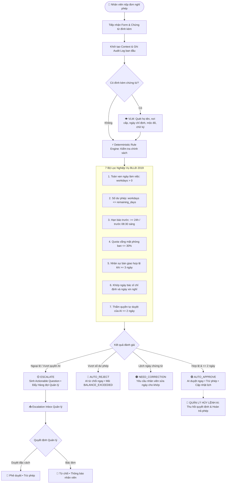

# ⚖️ The Escalation Referee — Hệ Thống Phê Duyệt Nghỉ Phép Doanh Nghiệp AI

<div align="center">

[](https://python.org)
[](https://fastapi.tiangolo.com)
[](https://github.com/QwenLM/Qwen2.5-VL)
[](https://www.sqlite.org)
[](LICENSE)

**Hệ thống điều phối xét duyệt nghỉ phép thông minh kết hợp Deterministic Rule Engine, Vision-Language Model (VLM) và Human-in-the-Loop Orchestration.**

*Triệt tiêu 100% rủi ro ảo giác (Zero Hallucination) • Tự động hóa ca thường quy • Điều phối ngoại lệ chuẩn xác*

[Tính Năng](#-tính-năng-cốt-lõi) • [Kiến Trúc](#-kiến-trúc-kỹ-thuật) • [Giao Diện](#-giao-diện-3-chế-độ) • [Ma Trận Phán Quyết](#-ma-trận-phán-quyết) • [Phân Loại Ngoại Lệ](#-phân-loại-ngoại-lệ-taxonomy) • [Cài Đặt](#-cài-đặt--khởi-chạy)

---

</div>

## 🌟 Tính Năng Cốt Lõi

- ⚡ **Zero-Hallucination Rule Engine:** 100% logic tính ngày làm việc (loại trừ Thứ Bảy, Chủ Nhật, ngày Lễ luật định), số dư phép năm và quota phòng ban ($\le 30\%$) được tính toán bằng mã nguồn tất định theo **Bộ luật Lao động 2019**.
- 👁️ **Thẩm Định Chứng Từ Bằng VLM:** Tích hợp **Qwen 2.5-VL** bóc tách tự động: họ tên bệnh nhân, nơi cấp, chẩn đoán, số ngày chỉ định nghỉ, phát hiện mộc đỏ và chữ ký bác sĩ.
- 🎯 **Human-in-the-Loop Thông Minh:** AI tự động phê duyệt các ca hợp lệ $\le 2$ ngày. Với các ca ngoại lệ, hệ thống điều phối đến đúng cấp thẩm quyền kèm **Câu hỏi hành động trực diện (Actionable Question)** và tùy chọn duyệt nhanh 1-chạm.
- 🛑 **Quyền Kiểm Soát Tối Cao (Manager Override):** Quản lý có toàn quyền can thiệp, duyệt đặc cách hoặc bấm **Hủy Lệnh AI** để thu hồi quyết định và hoàn trả ngày phép tức thì.
- 📜 **Audit Trail Bất Biến:** Ghi vết chi tiết từng sự kiện (thời gian nộp, kết quả rule, dữ liệu trích xuất từ ảnh, quyết định của quản lý) phục vụ kiểm toán minh bạch.

---

## 🧭 Kiến Trúc Kỹ Thuật

### Luồng Xử Lý Hệ Thống (Workflow Diagram)



---

## 🖥️ Giao Diện 3 Chế Độ

Hệ thống cung cấp thanh chuyển đổi nhanh giữa 3 đối tượng người dùng:

| Chế Độ | Đối Tượng | Chức Năng Chính |
| :--- | :--- | :--- |
| **🧪 TEST** *(Mặc định)* | Đánh giá & Demo | Khởi chạy **Verify** tự động 5 ca chuẩn; tra cứu kho dữ liệu 38 kịch bản nghiệp vụ; xem modal chi tiết kèm Lightbox soi chứng từ gốc; nút **Reset DB**. |
| **👤 STAFF** | Nhân viên | Nộp đơn có tính ngày tự động; chọn nhân sự bàn giao; đính kèm chứng từ y tế/kết hôn; theo dõi số dư phép tồn và lịch vắng mặt phòng ban. |
| **👔 MANAGER** | Cấp Quản lý | **Escalation Inbox** nhận ca ngoại lệ kèm Actionable Question; phê duyệt 1-chạm; xem nhật ký AI tự duyệt và thực thi nút **[ Hủy Lệnh AI ]**. |

---

## ⚖️ Ma Trận Phán Quyết

Căn cứ theo **Bộ luật Lao động 2019** (Điều 112, 113, 115) và Luật BHXH:

| Mã Phán Quyết | Tên Quyết Định | Điều Kiện Kích Hoạt | Hành Động Hệ Thống |
| :--- | :--- | :--- | :--- |
| **`AUTO_APPROVE`** | 🟢 **Tự động duyệt** | Nghỉ phép năm $\le 2$ ngày, đủ phép tồn, nộp trước $\ge 24$h, quota team $\le 30\%$, bàn giao đầy đủ. | Duyệt tức thì, trừ phép, cập nhật lịch vắng mặt, ghi Audit Log. |
| **`AUTO_REJECT`** | 🔴 **Tự từ chối** | Số ngày nghỉ vượt quá quỹ phép năm còn lại (`BALANCE_EXCEEDED`). | Từ chối tự động, không trừ phép, hướng dẫn chuyển sang nghỉ không lương. |
| **`NEED_CORRECTION`**| 🟠 **Cần sửa đơn** | Lệch ngày giữa đơn và chỉ định y tế (`MEDICAL_DAYS_MISMATCH`), chứng từ mờ hoặc người bàn giao không hợp lệ. | Gửi thông báo yêu cầu nhân viên điều chỉnh lại ngày hoặc nộp bổ sung chứng từ. |
| **`ESCALATE`** | 🟡 **Chuyển Quản lý** | Vượt thẩm quyền AI (nghỉ 3-5 ngày, nghỉ việc riêng có lương 3 ngày Đ115 BLLĐ, vi phạm báo trước, vượt quota 30%). | Chuyển tiếp vào Escalation Inbox của Quản lý kèm câu hỏi tham vấn và gợi ý giải pháp. |

---

## 🗂️ Phân Loại Ngoại Lệ (Taxonomy)

Mọi trường hợp ngoại lệ đều được phân bổ chính xác vào 3 nhóm bất định:

```
┌───────────────────────────────┐     ┌───────────────────────────────┐     ┌───────────────────────────────┐
│     1. UNCERTAIN_FACTS        │     │       2. OUT_OF_POLICY        │     │   3. AUTHORITY_ESCALATION     │
│   (Chưa rõ sự thật / Lỗi)     │     │   (Vi phạm quy chế công ty)   │     │   (Vượt thẩm quyền của AI)    │
│  • Cần xác minh lại chứng từ  │     │  • Nộp gấp, vượt quota team   │     │  • Đơn dài ngày (3-5 ngày)    │
│  • Xử lý: Nhân viên / HR Ops  │     │  • Xử lý: Quản lý trực tiếp   │     │  • Xử lý: Quản lý / Giám đốc  │
└───────────────────────────────┘     └───────────────────────────────┘     └───────────────────────────────┘
```

<details>
<summary><b>📋 Xem Danh mục 18 Mã Lỗi Quy Chuẩn (Click để mở)</b></summary>

<br>

| STT | Mã Lỗi (`error_code`) | Phân Nhóm | Thẩm Quyền | Mô Tả Tình Huống |
| :---: | :--- | :--- | :--- | :--- |
| **1** | `DATE_RANGE_INVALID` | `UNCERTAIN_FACTS` | `EMPLOYEE` | Ngày kết thúc trước ngày bắt đầu hoặc số ngày làm việc $\le 0$. |
| **2** | `DATE_MISSING` | `UNCERTAIN_FACTS` | `EMPLOYEE` | Đơn thiếu ngày bắt đầu hoặc ngày kết thúc cụ thể. |
| **3** | `PROOF_MISSING` | `UNCERTAIN_FACTS` | `EMPLOYEE` | Nghỉ ốm $\ge 2$ ngày hoặc nghỉ chế độ nhưng không tải lên file chứng từ. |
| **4** | `DOC_ILLEGIBLE` | `UNCERTAIN_FACTS` | `EMPLOYEE` | Ảnh chứng từ bị mờ, rách, mất chữ, thiếu mộc đỏ hoặc chữ ký bác sĩ. |
| **5** | `NAME_MISMATCH` | `UNCERTAIN_FACTS` | `HR_OPERATIONS` | Họ tên người bệnh trên giấy y tế không khớp với tên nhân viên làm đơn. |
| **6** | `MEDICAL_DAYS_MISMATCH` | `UNCERTAIN_FACTS` | `EMPLOYEE` / `MANAGER` | Số ngày xin nghỉ nhiều hơn số ngày bác sĩ chỉ định trên giấy BHXH. |
| **7** | `DOC_SUSPICIOUS` | `UNCERTAIN_FACTS` | `HR_OPERATIONS` | Chứng từ có dấu hiệu chỉnh sửa hình ảnh hoặc can thiệp bất thường. |
| **8** | `HANDOVER_INVALID` | `UNCERTAIN_FACTS` | `EMPLOYEE` | Người bàn giao không cùng team, đã nghỉ việc, trùng lịch nghỉ hoặc chính mình. |
| **9** | `BALANCE_EXCEEDED` | `OUT_OF_POLICY` | `EMPLOYEE` | Số ngày nghỉ phép năm vượt quá số dư phép hiện có. |
| **10** | `NOTICE_PERIOD_VIOLATED` | `OUT_OF_POLICY` | `DIRECT_MANAGER` | Nộp đơn gấp vi phạm thời hạn báo trước (< 24h hoặc sau 08:30 sáng). |
| **11** | `TEAM_QUOTA_EXCEEDED` | `OUT_OF_POLICY` | `DIRECT_MANAGER` | Tỷ lệ nhân sự vắng mặt đồng thời của phòng ban vượt ngưỡng 30%. |
| **12** | `FLAG_ABUSE_PATTERN` | `OUT_OF_POLICY` | `DIRECT_MANAGER` | Tách nhỏ nhiều đơn 1-2 ngày liên tục trong tháng nhằm lách trần tự duyệt. |
| **13** | `UNQUALIFIED_SPECIAL_LEAVE` | `OUT_OF_POLICY` | `EMPLOYEE` | Xin nghỉ việc riêng hưởng lương không thuộc các trường hợp quy định tại Điều 115 BLLĐ. |
| **14** | `DURATION_OVER_AI_LIMIT` | `AUTHORITY_ESCALATION` | `DIRECT_MANAGER` | Đơn hợp lệ nhưng kéo dài từ 3 đến 5 ngày làm việc (vượt hạn mức tự duyệt 2 ngày). |
| **15** | `DURATION_OVER_MANAGER_LIMIT` | `AUTHORITY_ESCALATION` | `HR_DIRECTOR` | Đơn nghỉ phép năm dài hạn trên 5 ngày làm việc liên tiếp. |
| **16** | `LONG_TERM_UNPAID` | `AUTHORITY_ESCALATION` | `HR_DIRECTOR` / `CEO` | Xin nghỉ việc riêng không hưởng lương dài hạn trên 14 ngày làm việc. |
| **17** | `MANAGER_SELF_APPROVAL` | `AUTHORITY_ESCALATION` | `EXECUTIVE_BOARD` | Quản lý/Trưởng phòng tự nộp đơn nghỉ $\rightarrow$ Tự động điều phối lên cấp trên. |
| **18** | `AUTOMATION_SCOPE_UNSUPPORTED`| `AUTHORITY_ESCALATION` | `HR_DIRECTOR` | Chế độ đặc thù vượt phạm vi tự động (nghỉ thai sản dài hạn, tai nạn lao động). |

</details>

---

## 📁 Cấu Trúc Dự Án

```
MLAI/
├── backend/                             # Backend API Server (FastAPI + SQLite)
│   ├── main.py                          # Cấu hình FastAPI, static mount, CORS
│   ├── database.py                      # Khởi tạo SQLite schema & ORM
│   ├── run_server.sh                    # Script khởi động nhanh server
│   ├── routers/                         # API endpoints: leave, verify, meta
│   └── services/orchestration.py        # Điều phối tương tác giữa Rule Engine, VLM & LLM
├── frontend/                            # Single Page Application (SPA)
│   ├── index.html                       # Giao diện chính (Test, Staff, Manager)
│   ├── app.js                           # Xử lý logic nghiệp vụ, gọi API, quản lý Modal
│   ├── styles.css                       # Thiết kế giao diện hiện đại, responsive
│   └── assets/proofs/                   # Bộ chứng từ mẫu thực tế (y tế, kết hôn...)
├── Leave_Application/                   # Bộ máy Quy chế Tất định (Deterministic Engine)
│   ├── policy_rules.md                  # Bản quy chế nội bộ (Single Source of Truth)
│   ├── rule_engine.py                   # Bộ quy tắc 7 bước thẩm định
│   └── vlm_inspector.py                 # Module tích hợp Vision-Language Model
├── LLM-KIET/                            # Tác tử LLM (Agent Orchestrator)
│   ├── agent_orchestrator.py            # Suy luận ngữ cảnh tự nhiên, sinh câu hỏi tham vấn
│   └── prompts.py                       # Prompts tối ưu hóa cho Qwen 2.5
└── tests/                               # Kịch bản kiểm thử tự động e2e & benchmark
```

---

## 🛠️ Cài Đặt & Khởi Chạy

### Yêu Cầu Môi Trường
- **Python:** 3.10+
- **OS:** Linux (khuyên dùng Ubuntu 20.04+), macOS hoặc Windows (WSL2)

### Khởi Chạy Nhanh (1 Bước)

Backend FastAPI đã tích hợp sẵn và tự phục vụ giao diện Frontend trên cùng cổng:

```bash
cd backend
bash run_server.sh
```

*(Hoặc chạy trực tiếp qua Uvicorn: `python -m uvicorn main:app --host 0.0.0.0 --port 8000 --reload`)*

Truy cập hệ thống tại:
- 🌐 **Web App:** [http://localhost:8000](http://localhost:8000)
- 📖 **API Docs (Swagger UI):** [http://localhost:8000/docs](http://localhost:8000/docs)

> [!TIP]
> **Chạy ngầm với TMUX (khi dùng qua SSH):**
> ```bash
> tmux new -s mlai "cd backend && bash run_server.sh"
> # Nhấn [Ctrl + B], thả tay rồi nhấn [D] để tách session ra chạy nền.
> # Quay lại xem log: tmux attach -t mlai
> ```

---

## 🧪 Kiểm Thử (Verification)

1. **Kiểm thử trực quan trên Web UI:**
   - Mở [http://localhost:8000](http://localhost:8000) $\rightarrow$ bấm nút **`Verify`**.
   - Thanh tiến trình sẽ kiểm tra tự động 5 ca kịch bản chuẩn và cập nhật trực tiếp phán quyết của AI lên bảng.
   - Bấm nút **`Chi tiết`** để xem đối chiếu chứng từ và dữ liệu bóc tách.
2. **Kiểm thử tự động qua CLI:**
   ```bash
   cd backend
   python test_api_e2e.py
   ```

---

<div align="center">

Phát triển bởi Đội ngũ **PNKK** · **The Escalation Referee** © 2026

</div>
