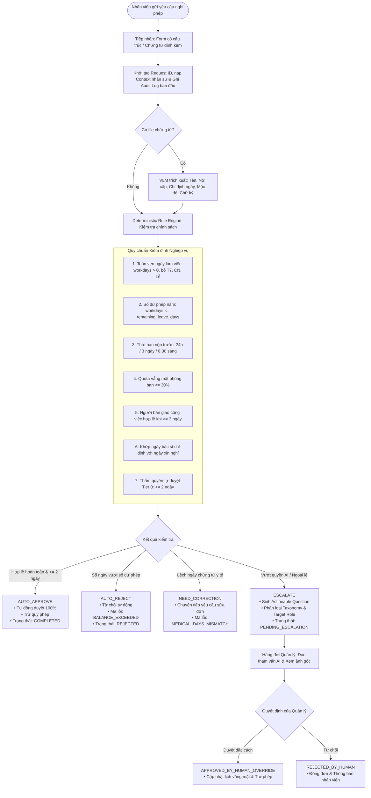

# 🚀 The Escalation Referee — Hệ Thống Phê Duyệt Nghỉ Phép Doanh Nghiệp AI

> **Hệ thống điều phối xét duyệt nghỉ phép thông minh kết hợp Deterministic Rule Engine, Vision-Language Model (VLM) và Human-in-the-Loop Orchestration.**  
> *Được thiết kế nhằm tối ưu hóa quy trình hành chính nhân sự, triệt tiêu 100% rủi ro ảo giác (zero hallucination), tự động hóa các ca thường quy và điều phối ngoại lệ chính xác tới đúng cấp thẩm quyền.*

---

## 📌 Mục Lục
1. [Tổng Quan & Giá Trị Cốt Lõi](#-tổng-quan--giá-trị-cốt-lõi)
2. [Kiến Trúc Kỹ Thuật & Sơ Đồ Hoạt Động](#-kiến-trúc-kỹ-thuật--sơ-đồ-hoạt-động)
3. [Giao Diện Người Dùng (3 Chế Độ Hoạt Động)](#-giao-diện-người-dùng-3-chế-độ-hoạt-động)
4. [Căn Cứ Pháp Lý & Ma Trận Phán Quyết](#-căn-cứ-pháp-lý--ma-trận-phán-quyết)
5. [Hệ Thống Phân Loại Ngoại Lệ (Taxonomy & 18 Mã Lỗi)](#-hệ-thống-phân-loại-ngoại-lệ-taxonomy--18-mã-lỗi)
6. [Mô Hình Dữ Liệu 4 Tầng (Canonical 4-Layer Record)](#-mô-hình-dữ-liệu-4-tầng-canonical-4-layer-record)
7. [Cấu Trúc Thư Mục Dự Án](#-cấu-trúc-thư-mục-dự-án)
8. [Hướng Dẫn Cài Đặt & Khởi Chạy Localhost](#-hướng-dẫn-cài-đặt--khởi-chạy-localhost)
9. [Cơ Chế Bảo Vệ An Toàn & Đạo Đức AI (Safeguards)](#-cơ-chế-bảo-vệ-an-toàn--đạo-đức-ai-safeguards)

---

## 🌟 Tổng Quan & Giá Trị Cốt Lõi

Trong các doanh nghiệp hiện đại, việc xét duyệt đơn nghỉ phép thường gặp hai thái cực:
- **Thủ công hoàn toàn:** Quản lý mất thời gian kiểm tra từng ngày phép tồn, đọc đơn, soi giấy khám bệnh; dễ gây chậm trễ hoặc bỏ sót vi phạm quy chế.
- **Tự động hóa mù quáng (Pure LLM):** Nếu giao toàn bộ cho AI tạo sinh, mô hình ngôn ngữ lớn có thể bị **ảo giác (hallucination)** khi tính toán lịch làm việc, nhầm lẫn ngày lễ/thứ Bảy/Chủ nhật hoặc tự duyệt các trường hợp vi phạm nghiêm trọng.

**The Escalation Referee** giải quyết triệt để vấn đề này bằng mô hình **Hybrid AI & Deterministic Validation**:
1. **Bộ máy quy chế tất định (Rule Engine):** Toàn bộ phép tính ngày làm việc, đối soát số dư phép, kiểm tra tỷ lệ vắng mặt phòng ban $\le 30\%$ và thời hạn báo trước được thực thi 100% bằng code logic chuẩn mực theo Bộ luật Lao động 2019 và Quy chế công ty.
2. **Trợ lý Thị giác & Ngôn ngữ (VLM & LLM Agent):** Sử dụng mô hình Vision-Language (Qwen 2.5 VL) để trích xuất thông tin chứng từ y tế/kết hôn (tên bệnh nhân, nơi cấp, chẩn đoán, số ngày chỉ định, mộc đỏ, chữ ký) và LLM Agent để hiểu ngữ cảnh tự nhiên, sinh câu hỏi hành động trực diện cho Quản lý.
3. **Con người kiểm soát tối cao (Human-in-the-Loop):** AI chỉ tự động duyệt các ca thường quy hoàn toàn hợp lệ ($\le 2$ ngày). Mọi ngoại lệ, vượt hạn mức hoặc dữ liệu chưa rõ ràng đều được chuyển tiếp đến đúng người có thẩm quyền kèm các lựa chọn xử lý nhanh 1 chạm. Quản lý luôn có quyền **Hủy Lệnh AI (Override)** bất kỳ lúc nào.

---

## 🧭 Kiến Trúc Kỹ Thuật & Sơ Đồ Hoạt Động

### Sơ đồ tương tác 3 bên (Staff ⟷ AI Engine ⟷ Manager)

```
[ NHÂN VIÊN ]                 [ TRỢ LÝ AI ]                    [ QUẢN LÝ ]
 (Staff UI)              (Agent Orchestrator)                 (Manager UI)
     │                             │                              │
     │ 1. Nộp đơn xin nghỉ         │                              │
     ├────────────────────────────►│                              │
     │                             │                              │
     │                             ├─► Phân tích & Đối chiếu      │
     │                             │   (Quỹ phép, ngày, VLM...)   │
     │                             │                              │
     │                             ├───[ Nhánh 1: Thường quy ]───►│ (Ghi Audit Log)
     │ 2a. Nhận kết quả:           │    TỰ ĐỘNG DUYỆT             │
     │◄─── 🟢 Tự duyệt             │                              │
     │                             │                              │
     │                             ├───[ Nhánh 2: Hết phép ]─────►│ (Ghi Audit Log)
     │ 2b. Nhận kết quả:           │    TỰ ĐỘNG TỪ CHỐI           │
     │◄─── 🔴 Tự từ chối           │                              │
     │                             │                              │
     │                             ├───[ Nhánh 3: Cần sửa ]──────►│
     │ 2c. Nhận yêu cầu:           │    YÊU CẦU SỬA ĐƠN           │
     │◄─── 🟠 Lệch chứng từ        │                              │
     │                             │                              │
     │                             └───[ Nhánh 4: Ngoại lệ ]─────►│ (Đẩy Hàng đợi)
     │ 2d. Nhận thông báo:              CHUYỂN TIẾP QUẢN LÝ       │
     │◄─── 🟡 Chờ quản lý                                         │
     │                                                            │
     │                                                            │ 3. Đọc Actionable Question
     │                                                            │    & Xem chứng từ gốc:
     │                                                            │    [Duyệt đặc cách/Từ chối]
     │                                                            │
     │ 4. Nhận kết quả mới                                        │
     │◄─── 🔵 Quản lý duyệt / 🔴 Từ chối ─────────────────────────┤
     │                                                            │
     │                                                            │ (Quyền can thiệp tối cao)
     │ 5. Thu hồi & hoàn trả phép                                 │ 🛑 HỦY LỆNH AI
     │◄─── 🔴 Đã thu hồi ─────────────────────────────────────────┤
```

### Sơ đồ luồng xử lý chi tiết (System Flowchart)



---

## 🖥️ Giao Diện Người Dùng (3 Chế Độ Hoạt Động)

Hệ thống được tổ chức thành 3 chế độ tương tác thông qua thanh điều hướng (Topbar Switcher):

```
┌────────────────────────────────────────────────────────────────────────┐
│  [ TEST (Kiểm thử) ]     [ STAFF (Nhân viên) ]     [ MANAGER (Quản lý) ]│
└────────────────────────────────────────────────────────────────────────┘
```

### 1. Tab TEST (Màn hình Mặc định khi Khởi động)
Được thiết kế riêng cho việc đánh giá, kiểm thử và nghiệm thu hệ thống với 2 chuyên mục:
- **Kiểm duyệt (5 Kịch Bản Kiểm Thử):**
  - **Bảng dữ liệu chuẩn 6 cột:** `NHÂN VIÊN`, `PHÒNG BAN`, `THỜI GIAN NGHỈ`, `SỐ NGÀY`, `CHI TIẾT`, `TRẠNG THÁI`.
  - **Nút `Verify`:** Khởi chạy tiến trình kiểm thử tự động, có thanh tiến trình (progress bar) và tự động cập nhật trực tiếp phán quyết của AI lên bảng.
  - **Nút `Chi tiết`:** Bật popup modal chi tiết đơn nghỉ phép chuẩn hóa (thông tin nhân sự, loại phép, lý do, người nhận bàn giao, chứng từ kèm nút xem ảnh gốc qua Lightbox, và căn cứ đánh giá của AI Engine).
  - **Nút `Reset DB`:** Đặt lại cơ sở dữ liệu mẫu về trạng thái ban đầu bất cứ lúc nào.
- **Kho dữ liệu (Kho 38 Kịch bản Toàn diện):**
  - Bộ kịch bản bao quát đầy đủ 4 nhóm nghiệp vụ: *13 ca Thường quy*, *8 ca Chưa xác định thực tế*, *7 ca Nằm ngoài quy định*, *10 ca Vượt thẩm quyền AI*.

### 2. Tab STAFF (Dành Cho Nhân Viên)
- **Chọn nhân sự Demo:** Cho phép chuyển đổi giữa các hồ sơ nhân viên trong tổ chức để thử nghiệm nhiều tình huống.
- **Nộp đơn xin nghỉ phép:**
  - Điền biểu mẫu chọn loại nghỉ (Phép năm, Nghỉ ốm BHXH, Nghỉ kết hôn, Việc riêng không lương...).
  - Chọn khoảng ngày nghỉ (hệ thống tự động tính số ngày làm việc thực tế).
  - Chọn nhân sự bàn giao cùng phòng ban.
  - Tải lên chứng từ đính kèm (giấy ra viện, giấy nghỉ BHXH, giấy kết hôn).
- **Theo dõi cá nhân:** Tra cứu số dư phép năm còn lại, lịch sử các đơn đã nộp và lịch vắng mặt của phòng ban trong tuần.

### 3. Tab MANAGER (Dành Cho Cấp Quản Lý)
- **Hàng đợi chuyển tiếp (Escalation Inbox):**
  - Hiển thị danh sách các đơn cần con người ra quyết định.
  - **Khung tham vấn AI (Actionable Question):** Đặt câu hỏi trực diện vào quyền quyết định (ví dụ: *"Đơn xin nghỉ 3 ngày nhưng giấy bác sĩ chỉ định 1 ngày. Quản lý chấp thuận cho nghỉ không lương 2 ngày còn lại hay yêu cầu nhân viên sửa đơn?"*).
  - **Tùy chọn nhanh 1 chạm:** Các nút duyệt nhanh (Duyệt đặc cách, Từ chối, Yêu cầu bổ sung thông tin).
- **Nhật ký AI tự duyệt & Quyền kiểm soát tối cao:**
  - Bảng thống kê toàn bộ các đơn do AI tự động duyệt trong phiên.
  - **Nút `[ Hủy Lệnh AI ]`:** Trao quyền cho Quản lý thu hồi quyết định của AI trong trường hợp khẩn cấp (xung đột lịch trực, dự án gấp), tự động hoàn trả số ngày phép cho nhân viên.

---

## ⚖️ Căn Cứ Pháp Lý & Ma Trận Phán Quyết

### Căn cứ quy chế & luật định
Hệ thống tuân thủ nghiêm ngặt các quy định pháp luật lao động hiện hành và nội quy doanh nghiệp:
- **Bộ luật Lao động 2019:**
  - **Điều 112:** Nghỉ các ngày Lễ, Tết hưởng nguyên lương.
  - **Điều 113:** Chế độ nghỉ phép năm (12 ngày/năm đối với điều kiện bình thường, tăng thêm theo thâm niên 5 năm/1 ngày).
  - **Điều 115:** Chế độ nghỉ việc riêng hưởng 100% lương (Bản thân kết hôn: 3 ngày; Con đẻ/con nuôi kết hôn: 1 ngày; Cha/mẹ/vợ/chồng/con chết: 3 ngày) và nghỉ việc riêng không hưởng lương (1 ngày).
- **Luật Bảo hiểm Xã hội:** Chế độ ốm đau có Giấy chứng nhận nghỉ việc hưởng BHXH hợp lệ do cơ sở khám chữa bệnh có thẩm quyền cấp.

### 4 Nhóm Phán Quyết Cốt Lõi (Decisions)

| Mã Quyết Định | Tên Phán Quyết | Điều Kiện Kích Hoạt | Hành Động Hệ Thống |
| :--- | :--- | :--- | :--- |
| **`AUTO_APPROVE`** | **Tự động duyệt** | Nghỉ phép năm $\le 2$ ngày, đủ số dư phép, nộp trước $\ge 24$h, quota vắng mặt team $\le 30\%$, có bàn giao nếu cần. | AI tự duyệt ngay lập tức, trừ số dư phép năm, cập nhật lịch vắng mặt và ghi Audit Log. |
| **`AUTO_REJECT`** | **Từ chối tự động** | Số ngày xin nghỉ vượt quá số dư phép năm hiện có (`BALANCE_EXCEEDED`), hoặc lý do xin nghỉ vi phạm quy chuẩn. | AI từ chối đơn ngay lập tức, không trừ phép, hướng dẫn nhân viên điều chỉnh số ngày hoặc xin nghỉ không lương. |
| **`NEED_CORRECTION`**| **Cần sửa đơn** | Lệch số ngày giữa đơn xin và giấy chỉ định y tế (`MEDICAL_DAYS_MISMATCH`), chứng từ bị mờ hoặc người bàn giao không hợp lệ. | Chuyển tiếp đơn, yêu cầu nhân viên chỉnh sửa ngày cho khớp chứng từ hoặc bổ sung thông tin. |
| **`ESCALATE`** | **Chuyển Quản lý** | Vượt trần tự duyệt của AI (nghỉ 3-5 ngày, nghỉ kết hôn 3 ngày hưởng 100% lương theo Điều 115 BLLĐ, vi phạm báo trước, vượt quota 30%). | Gửi vào Escalation Inbox của Quản lý kèm câu hỏi tham vấn thông minh và gợi ý xử lý nhanh. |

---

## 🗂️ Hệ Thống Phân Loại Ngoại Lệ (Taxonomy & 18 Mã Lỗi)

Toàn bộ các tình huống ngoại lệ được phân loại vào đúng **3 nhóm bất định (Uncertainty Categories)**:

```
                                  ┌─────────────────────────────┐
                                  │      YÊU CẦU NGHỈ PHÉP      │
                                  └──────────────┬──────────────┘
                                                 │
            ┌────────────────────────────────────┼────────────────────────────────────┐
            ▼                                    ▼                                    ▼
┌─────────────────────────────┐    ┌─────────────────────────────┐    ┌─────────────────────────────┐
│    1. UNCERTAIN_FACTS       │    │      2. OUT_OF_POLICY       │    │  3. AUTHORITY_ESCALATION    │
│  (Chưa rõ sự thật / Lỗi)    │    │  (Vi phạm quy định công ty) │    │  (Vượt thẩm quyền của AI)   │
│  • Cần xác minh chứng từ    │    │  • Cần xem xét ngoại lệ     │    │  • Đơn hợp lệ nhưng dài hạn │
│  • Cần sửa đổi thông tin    │    │  • Cần duyệt đặc cách       │    │  • Cần Quản lý / HRD duyệt  │
└───────────┬─────────────────┘    └─────────────┬───────────────┘    └─────────────┬───────────────┘
            │                                    │                                  │
            ▼                                    ▼                                  ▼
      Nhân viên /                         Trưởng phòng /                     Trưởng phòng /
      HR Operations                       HR Operations                      HRD / Ban Giám đốc
```

### Danh mục 18 Mã Lỗi Quy Chuẩn

| STT | Mã Lỗi (`error_code`) | Nhóm Bất Định | Thẩm Quyền Xử Lý | Tình Huống Chi Tiết |
| :---: | :--- | :--- | :--- | :--- |
| **1** | `DATE_RANGE_INVALID` | `UNCERTAIN_FACTS` | `EMPLOYEE` | Ngày kết thúc trước ngày bắt đầu (`from_date > to_date`) hoặc số ngày làm việc tính ra $\le 0$. |
| **2** | `DATE_MISSING` | `UNCERTAIN_FACTS` | `EMPLOYEE` | Đơn thiếu ngày bắt đầu hoặc ngày kết thúc cụ thể. |
| **3** | `PROOF_MISSING` | `UNCERTAIN_FACTS` | `EMPLOYEE` | Nghỉ ốm $\ge 2$ ngày hoặc nghỉ chế độ nhưng không tải lên file chứng từ xác minh. |
| **4** | `DOC_ILLEGIBLE` | `UNCERTAIN_FACTS` | `EMPLOYEE` | Ảnh chứng từ bị mờ, rách, mất góc, không đọc được chữ, thiếu con dấu hoặc chữ ký bác sĩ. |
| **5** | `NAME_MISMATCH` | `UNCERTAIN_FACTS` | `HR_OPERATIONS` | Họ tên người bệnh trên giấy tờ y tế không khớp với tên nhân sự làm đơn. |
| **6** | `MEDICAL_DAYS_MISMATCH` | `UNCERTAIN_FACTS` | `EMPLOYEE` / `MANAGER`| Số ngày xin nghỉ nhiều hơn số ngày bác sĩ chỉ định trên Giấy nghỉ việc hưởng BHXH. |
| **7** | `DOC_SUSPICIOUS` | `UNCERTAIN_FACTS` | `HR_OPERATIONS` | Chứng từ có dấu hiệu tẩy xóa photoshop, chỉnh sửa số ngày hoặc làm giả bằng AI. |
| **8** | `HANDOVER_INVALID` | `UNCERTAIN_FACTS` | `EMPLOYEE` | Người nhận bàn giao không cùng phòng, đã nghỉ việc, trùng lịch nghỉ hoặc trùng chính mình. |
| **9** | `BALANCE_EXCEEDED` | `OUT_OF_POLICY` | `EMPLOYEE` | Số ngày xin nghỉ phép năm vượt quá số dư phép hiện có $\rightarrow$ AI tự động từ chối. |
| **10** | `NOTICE_PERIOD_VIOLATED` | `OUT_OF_POLICY` | `DIRECT_MANAGER` | Nộp đơn gấp vi phạm thời hạn báo trước (dưới 24h với đơn $\le 2$ ngày, sau 08:30 sáng với đơn ốm). |
| **11** | `TEAM_QUOTA_EXCEEDED` | `OUT_OF_POLICY` | `DIRECT_MANAGER` | Tỷ lệ nhân sự vắng mặt của phòng ban vượt ngưỡng an toàn $30\%$. |
| **12** | `FLAG_ABUSE_PATTERN` | `OUT_OF_POLICY` | `DIRECT_MANAGER` | Chia nhỏ nhiều đơn nghỉ 1-2 ngày liên tiếp trong cùng 1 tháng nhằm lách trần tự duyệt của AI. |
| **13** | `UNQUALIFIED_SPECIAL_LEAVE`| `OUT_OF_POLICY`| `EMPLOYEE` | Xin nghỉ việc riêng có lương nhưng lý do không thuộc diện quy định tại Điều 115 BLLĐ. |
| **14** | `DURATION_OVER_AI_LIMIT` | `AUTHORITY_ESCALATION` | `DIRECT_MANAGER` | Đơn hợp lệ nhưng thời lượng từ 3 đến 5 ngày làm việc (vượt trần tự duyệt 2 ngày của AI). |
| **15** | `DURATION_OVER_MANAGER_LIMIT`| `AUTHORITY_ESCALATION`| `HR_DIRECTOR` | Đơn nghỉ phép năm dài hạn trên 5 ngày làm việc liên tiếp $\rightarrow$ Vượt thẩm quyền Trưởng phòng. |
| **16** | `LONG_TERM_UNPAID` | `AUTHORITY_ESCALATION` | `HR_DIRECTOR` / `CEO` | Nghỉ việc riêng không hưởng lương dài hạn trên 14 ngày làm việc. |
| **17** | `MANAGER_SELF_APPROVAL` | `AUTHORITY_ESCALATION` | `EXECUTIVE_BOARD` | Trưởng phòng/Quản lý tự nộp đơn nghỉ phép $\rightarrow$ Điều phối lên cấp trên trực tiếp duyệt. |
| **18** | `AUTOMATION_SCOPE_UNSUPPORTED`| `AUTHORITY_ESCALATION`| `HR_DIRECTOR` | Các chế độ phức tạp vượt phạm vi tự động hóa (nghỉ thai sản dài hạn, tai nạn lao động). |

---

## 📊 Mô Hình Dữ Liệu 4 Tầng (Canonical 4-Layer Record)

Mỗi hồ sơ yêu cầu nghỉ phép được biểu diễn dưới dạng bản ghi 4 tầng dữ liệu hoàn chỉnh:

```
┌────────────────────────────────────────────────────────────────────────┐
│ TẦNG 1: PROFILE NHÂN SỰ & TỔ CHỨC (Employee & Org Context)            │
│ • Định danh, chức vụ, thâm niên, số dư phép, quân số phòng, tỷ lệ vắng  │
├────────────────────────────────────────────────────────────────────────┤
│ TẦNG 2: DỮ LIỆU ĐĂNG KÝ NGHỈ PHÉP (Leave Request Facts)               │
│ • Loại nghỉ, lý do, ngày bắt đầu/kết thúc, giờ nộp, người bàn giao    │
├────────────────────────────────────────────────────────────────────────┤
│ TẦNG 3: THẨM ĐỊNH CHỨNG TỪ BẰNG VLM (Proof & Visual Inspection)       │
│ • Loại giấy tờ, độ rõ, tên người bệnh, chỉ định bác sĩ, mộc đỏ, chữ ký│
├────────────────────────────────────────────────────────────────────────┤
│ TẦNG 4: ĐÁNH GIÁ QUY CHẾ & VẾT DUYỆT (Rule Engine & Resolution)       │
│ • Ngày làm việc thực tế, quyết định AI, câu hỏi hành động, audit log   │
└────────────────────────────────────────────────────────────────────────┘
```

### Cấu trúc JSON Mẫu Chuẩn

```json
{
  "id": "TC-VLM-03",
  "employee": {
    "employee_id": "EMP004",
    "name": "Lê Văn Nam",
    "department": "Engineering",
    "role": "Backend Engineer",
    "manager_id": "EMP001",
    "remaining_leave_days": 10.0,
    "total_team_members": 6,
    "concurrent_absences": 0
  },
  "request": {
    "leave_type": "SICK_MEDICAL",
    "reason_category": "PERSONAL",
    "reason": "Rối loạn tiêu hóa cấp, theo dõi ngộ độc thức ăn",
    "from_date": "2026-10-12",
    "to_date": "2026-10-14",
    "submitted_at": "2026-10-12T07:30:00+07:00",
    "handover_person_id": null,
    "handover_person_name": "Không yêu cầu"
  },
  "proof_verification": {
    "has_attachment": true,
    "proof_file": "proof_emp004_sick_days_mismatch.png",
    "proof_type": "MEDICAL_LEAVE_CERTIFICATE",
    "document_readability": "READABLE",
    "doc_patient_name": "Lê Văn Nam",
    "doc_issuer": "Bệnh viện Đa khoa Hồng Ngọc",
    "doc_diagnosis": "Rối loạn tiêu hóa cấp",
    "days_granted_by_doctor": 1,
    "recommended_from_date": "2026-10-12",
    "recommended_to_date": "2026-10-12",
    "has_red_stamp": true,
    "has_doctor_signature": true,
    "is_tampered": false
  },
  "engine_evaluation": {
    "requested_calendar_days": 3,
    "requested_working_days": 3,
    "decision": "NEED_CORRECTION",
    "uncertainty_category": "UNCERTAIN_FACTS",
    "error_code": "MEDICAL_DAYS_MISMATCH",
    "target_role": "EMPLOYEE",
    "actionable_question": "Đơn xin nghỉ 3 ngày (12/10 - 14/10) nhưng giấy chứng nhận y tế chỉ chỉ định nghỉ 1 ngày (12/10). Nhân viên cần điều chỉnh lại số ngày hoặc bổ sung thông tin để khớp với chứng từ.",
    "quick_action_options": ["ADJUST_TO_1_DAY", "UNPAID_FOR_REST", "REQUEST_NEW_PROOF"]
  },
  "audit_and_resolution": {
    "status": "PENDING",
    "human_resolution": null,
    "deducted_days": 0.0,
    "submitted_at": "2026-10-12T07:30:00+07:00"
  }
}
```

---

## 📁 Cấu Trúc Thư Mục Dự Án

```
MLAI/
├── backend/                             # Backend API Server (FastAPI)
│   ├── main.py                          # Khởi tạo FastAPI app, static mounts, CORS
│   ├── database.py                      # Kết nối SQLite & Schema
│   ├── storage.py                       # Quản lý lưu trữ file & demo state
│   ├── run_server.sh                    # Script khởi chạy nhanh Backend Server (Port 8000)
│   ├── routers/
│   │   ├── leave_router.py              # Xử lý đơn nghỉ phép, thẩm định, phê duyệt Quản lý
│   │   ├── verify_router.py             # Bộ Test Harness Benchmark Sprint 1 (5 ca chuẩn)
│   │   └── meta_router.py               # Thống kê, xuất dữ liệu, cấu hình hệ thống
│   ├── services/
│   │   └── orchestration.py             # Điều phối luồng giữa Rule Engine, VLM và LLM
│   └── test_api_e2e.py                  # Script kiểm thử API End-to-End
│
├── frontend/                            # Web Client Single Page Application (SPA)
│   ├── index.html                       # Giao diện chính (Topbar 3 mode, Bảng 5 ca, Kho 38 ca, Modal)
│   ├── app.js                           # Logic điều khiển giao diện, gọi API, quản lý modal
│   ├── styles.css                       # Thiết kế CSS hiện đại, chuẩn thẩm mỹ cao cấp, responsive
│   └── assets/
│       └── proofs/                      # Kho 26 ảnh chứng từ mẫu thực tế (y tế, kết hôn, mờ, lệch ngày)
│
├── Leave_Application/                   # Bộ máy Quy chế Tất định (Deterministic Engine)
│   ├── policy_rules.md                  # Bản quy chế nội bộ (Authoritative Source of Truth)
│   ├── rule_engine.py                   # Bộ máy suy diễn logic 7 bộ lọc
│   ├── domain.py                        # Khai báo cấu trúc dữ liệu domain chuẩn
│   ├── taxonomy.py                      # Cây phân loại 3 nhóm ngoại lệ & 18 mã lỗi
│   └── vlm_inspector.py                 # Tích hợp Vision-Language Model quét chứng từ
│
├── LLM-KIET/                            # Tác tử LLM Agent (Orchestration & Reasoning)
│   ├── agent_orchestrator.py            # Phân tích ngôn ngữ tự nhiên, sinh Actionable Question
│   └── prompts.py                       # Cấu trúc Prompt tối ưu cho Qwen 2.5
│
├── tests/                               # Bộ kịch bản kiểm thử tự động
│   ├── test_new_org_workflow.py         # Kiểm thử luồng tổ chức và nghiệp vụ mới
│   ├── test_model_invocation_counts.py  # Đếm số lần kích hoạt mô hình
│   └── generate_test_proofs.py          # Script sinh dữ liệu chứng từ kiểm thử
│
├── requirements.txt                     # Danh sách thư viện Python phụ thuộc
└── README.md                            # Tài liệu tổng hợp hướng dẫn toàn diện dự án
```

---

## 🛠️ Hướng Dẫn Cài Đặt & Khởi Chạy Localhost

### Yêu Cầu Môi Trường
- **Hệ điều hành:** Linux (Ubuntu 20.04+ khuyên dùng), macOS, Windows (WSL2).
- **Python:** Phiên bản 3.10 trở lên.
- **Trình duyệt:** Chrome, Firefox, Edge, Safari hoặc trình duyệt nhân Chromium hiện đại.

---

### Cách 1: Khởi chạy Nhanh Trong 1 Lệnh (Khuyên Dùng ⭐)

FastAPI đã được cấu hình phục vụ trực tiếp giao diện Frontend tĩnh trên cùng cổng 8000.

#### Bước 1: Mở Terminal và di chuyển vào thư mục backend
```bash
cd /workingspace_aiclub/WorkingSpace/Personal/phongnh/MLAI/backend
```

#### Bước 2: Khởi chạy Server
- **Cách 1 (Dùng bash script có sẵn):**
  ```bash
  bash run_server.sh
  ```
- **Cách 2 (Chạy trực tiếp qua Uvicorn):**
  ```bash
  python -m uvicorn main:app --host 0.0.0.0 --port 8000 --reload
  ```

#### Bước 3: Mở trình duyệt truy cập
- **Giao diện Web App (SPA):** 👉 [http://localhost:8000](http://localhost:8000)
- **Tài liệu API (Swagger UI):** 👉 [http://localhost:8000/docs](http://localhost:8000/docs)
- **Tài liệu API ReDoc:** 👉 [http://localhost:8000/redoc](http://localhost:8000/redoc)

---

### Cách 2: Chạy Ngầm Bằng TMUX (Tiện Lợi Khi Làm Việc Qua SSH)

Dùng `tmux` giúp server hoạt động liên tục trong nền, không bị ngắt khi đóng terminal hoặc mất kết nối:

```bash
# 1. Tạo session tmux mới
tmux new -s mlai

# 2. Chuyển thư mục và chạy server
cd /workingspace_aiclub/WorkingSpace/Personal/phongnh/MLAI/backend
bash run_server.sh

# 3. Thoát ra ngoài giữ server chạy ngầm: Nhấn tổ hợp phím [Ctrl + B], thả tay rồi nhấn phím [D]

# 4. Khi cần quay lại xem log:
tmux attach -t mlai

# 5. Dừng hoàn toàn session tmux:
tmux kill-session -t mlai
```

---

### Cách 3: Chạy Tách Biệt Frontend (Port 3000) & Backend (Port 8000)

Nếu bạn cần phát triển riêng giao diện người dùng:
```bash
# Terminal 1: Chạy Backend
cd /workingspace_aiclub/WorkingSpace/Personal/phongnh/MLAI/backend
bash run_server.sh

# Terminal 2: Chạy Frontend trên port 3000
cd /workingspace_aiclub/WorkingSpace/Personal/phongnh/MLAI/frontend
python3 -m http.server 3000
```
👉 Truy cập giao diện tại: [http://localhost:3000](http://localhost:3000) *(Frontend đã tích hợp sẵn CORS tới backend `http://localhost:8000`)*.

---

### 🧪 Hướng Dẫn Kiểm Thử (Verify)

1. **Kiểm thử trực tiếp trên Web UI:**
   - Mở [http://localhost:8000](http://localhost:8000) (mặc định mở tại tab **Test**).
   - Tại mục **Kiểm duyệt (5 Kịch Bản Kiểm Thử)**, bấm nút **`Verify`** ở góc trên.
   - Quan sát thanh tiến trình chạy qua từng kịch bản và cột **Trạng thái** trên bảng tự động chuyển sang phán quyết thực tế của AI (`Tự động duyệt`, `Từ chối tự động`, `Cần sửa đơn`, `Chờ người có thẩm quyền`).
   - Bấm nút **`Chi tiết`** ở từng dòng để kiểm tra popup modal biểu mẫu đơn và ảnh chứng từ gốc.
2. **Kiểm thử tự động bằng CLI / Script:**
   ```bash
   cd /workingspace_aiclub/WorkingSpace/Personal/phongnh/MLAI/backend
   python test_api_e2e.py
   ```

---

### ❓ Xử Lý Sự Cố Thường Gặp

1. **Lỗi cổng 8000 bị chiếm (`Address already in use`):**
   ```bash
   # Tìm và giải phóng tiến trình chiếm port 8000
   lsof -i :8000
   kill -9 $(lsof -t -i:8000)
   ```
2. **Trình duyệt hiển thị giao diện cũ (Browser Cache):**
   - Nhấn tổ hợp phím **Ctrl + F5** (hoặc Cmd + Shift + R trên Mac) để xóa cache và nạp phiên bản CSS/JS mới nhất.

---

## 🛡️ Cơ Chế Bảo Vệ An Toàn & Đạo Đức AI (Safeguards)

1. **Nguyên tắc "Zero-Hallucination" (Không ảo giác số liệu):**
   - Toàn bộ phép tính ngày làm việc thực tế được chạy bằng Python `datetime` và module lịch làm việc tất định (loại trừ Thứ Bảy, Chủ Nhật và ngày lễ luật định). Tuyệt đối không để LLM tự tính ngày.
2. **Nguyên tắc "Fail-Safe Escalation":**
   - Bất kỳ khi nào dữ liệu đầu vào bị thiếu, ảnh chứng từ không thể bóc tách rõ ràng hoặc phát hiện mâu thuẫn, hệ thống luôn ưu tiên dừng lại và chuyển tiếp (`ESCALATE`) cho con người, cam kết không tự phê duyệt bừa bãi.
3. **Semantic Validity Guardrail (Kiểm duyệt ngữ nghĩa):**
   - Chặn đứng các lý do xin nghỉ vi phạm kỷ luật hoặc thiếu chuẩn mực lao động (*"lười biếng"*, *"chán đi làm"*, *"thích thì nghỉ"*), tự động chuyển thẳng đến Trưởng phòng kèm yêu cầu giải trình.
4. **Quyền kiểm soát tối cao của con người (Human Override):**
   - AI chỉ là trợ lý sàng lọc và đề xuất. Cấp Quản lý luôn có quyền đưa ra quyết định đặc cách khác với nhận định ban đầu của AI, hoặc bấm **Hủy Lệnh AI** để thu hồi quyết định tự động bất cứ lúc nào.
5. **Nhật ký kiểm toán bất biến (Immutable Audit Trail):**
   - Toàn bộ các bước từ lúc nộp đơn, qua bộ máy quy chế, quét chứng từ VLM đến phản hồi của Quản lý đều được ghi vết chi tiết đến từng mili-giây vào SQLite, đảm bảo tính giải trình và minh bạch tuyệt đối khi thanh kiểm tra.

---

<div align="center">
  <sub>Phát triển bởi Đội ngũ <b>PNKK</b> · Hệ thống <b>The Escalation Referee</b> © 2026</sub>
</div>
