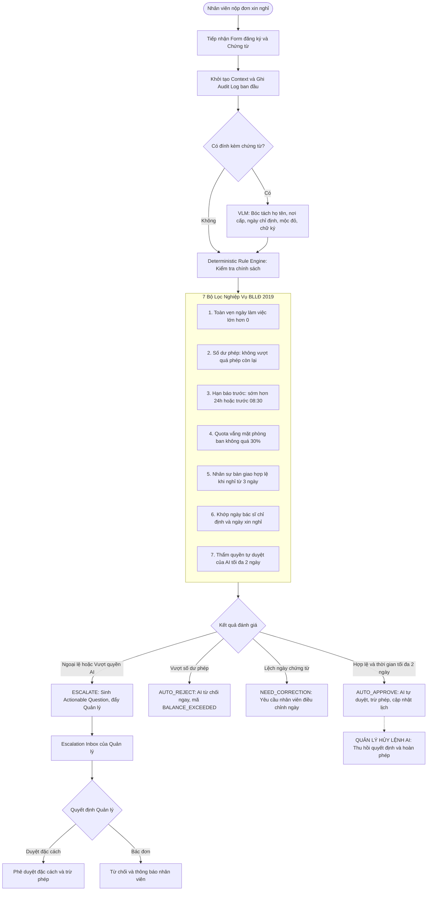

# The Escalation Referee — Hệ Thống Phê Duyệt Nghỉ Phép Doanh Nghiệp AI

[](https://python.org)
[](https://fastapi.tiangolo.com)
[](https://github.com/QwenLM/Qwen2.5-VL)
[](https://www.sqlite.org)
[](LICENSE)

> **Hệ thống điều phối xét duyệt nghỉ phép kết hợp Deterministic Rule Engine, Vision-Language Model (VLM) và Human-in-the-Loop Orchestration.**  
> *Triệt tiêu rủi ro ảo giác (Zero Hallucination) • Tự động hóa ca thường quy • Điều phối ngoại lệ chính xác*

**📺 Video Demo:** [https://youtu.be/FjoYJwa732c](https://youtu.be/FjoYJwa732c)  
**📊 Dataset Mẫu:** [Google Sheets Link](https://docs.google.com/spreadsheets/d/1_d9vUImx0TX7yeGoFwtnWIQRDaDFpi_XKqALEeNs1KA/edit?gid=1111531951#gid=1111531951)

[Tổng Quan](#tổng-quan-dự-án) • [Kiến Trúc Kỹ Thuật](#kiến-trúc-kỹ-thuật--quy-trình-backend) • [Giao Diện Hoạt Động](#giao-diện-hoạt-động-3-chế-độ) • [Ma Trận Phán Quyết](#ma-trận-phán-quyết) • [Phân Loại Ngoại Lệ](#phân-loại-ngoại-lệ-taxonomy) • [Cài Đặt & Khởi Chạy](#cài-đặt--khởi-chạy)

---

## Tổng Quan Dự Án

- **Thực trạng**: Phê duyệt nghỉ phép thủ công thường tốn nhiều thời gian đối chiếu giấy tờ và dễ bỏ sót sai phạm quy chế. Ngược lại, việc tự động hóa thuần túy bằng AI tạo sinh (Pure LLM) lại đối mặt với rủi ro nghiêm trọng về **ảo giác số liệu (hallucination)** — dễ tính sai ngày nghỉ cuối tuần/ngày lễ và duyệt sai thẩm quyền theo luật lao động.
- **Giải pháp**: **The Escalation Referee** ứng dụng mô hình kết hợp **Hybrid AI & Deterministic Validation**: sử dụng bộ máy quy chế tất định (Rule Engine) để triệt tiêu 100% ảo giác số liệu theo Bộ luật Lao động 2019, mô hình thị giác **Qwen 2.5-VL** để tự động thẩm định chứng từ y tế/kết hôn, và cơ chế **Human-in-the-Loop** chỉ tự động duyệt ca thường quy (≤ 2 ngày) đồng thời điều phối ngoại lệ đến đúng người có thẩm quyền kèm câu hỏi hành động trực diện.


---

## Kiến Trúc Kỹ Thuật & Quy Trình Backend


Khảo sát luồng điều phối trung tâm tại dịch vụ `LeaveOrchestratorService` (`backend/services/orchestration.py`), quy trình xử lý của backend diễn ra theo 5 bước tuần tự và nguyên tử (atomic):

1. **Nạp Ngữ Cảnh (Context Loading):** Tiếp nhận dữ liệu đăng ký nghỉ phép, truy xuất hồ sơ nhân sự từ SQLite (số dư phép tồn, tỷ lệ vắng mặt phòng ban) và tính toán số ngày làm việc thực tế qua `CalendarService` (loại trừ Thứ Bảy, Chủ Nhật và ngày lễ theo luật định).
2. **Thẩm Định Chứng Từ Bằng VLM (Visual Inspection):** Khi có file đính kèm, mô hình **Qwen 2.5-VL** bóc tách tên bệnh nhân, nơi cấp, số ngày chỉ định, mộc đỏ, chữ ký bác sĩ và tính điểm tương quan (`correlation_score`) so với đơn đăng ký.
3. **Đánh Giá Quy Chế Tất Định (Rule Engine Evaluation):** Đưa toàn bộ ngữ cảnh qua `LeaveRuleEngine` với 7 bộ lọc chính sách tất định (kiểm tra hạn mức phép, tỷ lệ vắng mặt đồng thời ≤ 30%, thời hạn báo trước, nhân sự bàn giao, trần tự duyệt).
4. **Phân Nhánh Phán Quyết (Decision Routing):** Xác định 1 trong 4 phán quyết cốt lõi: `AUTO_APPROVE` (tự duyệt ca thường quy ≤ 2 ngày và trừ phép), `AUTO_REJECT` (tự từ chối khi hết phép), `NEED_CORRECTION` (yêu cầu nhân viên sửa ngày cho khớp giấy khám), hoặc `ESCALATE` (sinh `actionable_question` kèm các tùy chọn duyệt nhanh 1-chạm gửi vào Inbox của Quản lý).
5. **Kiểm Toán & Hỗ Trợ Can Thiệp (Audit & Manager Override):** Ghi nhận chi tiết lịch sử xử lý vào SQLite; Quản lý giữ quyền tối cao để phê duyệt đặc cách hoặc bấm **Hủy Lệnh AI** nhằm thu hồi quyết định và hoàn trả ngày phép tức thì.



```mermaid
flowchart TD
    Start([Nhân viên nộp đơn xin nghỉ]) --> Ingest[Tiếp nhận Form đăng ký và Chứng từ]
    Ingest --> InitContext[Khởi tạo Context và Ghi Audit Log ban đầu]
    
    InitContext --> VLM_Scan{Có đính kèm chứng từ?}
    VLM_Scan -->|Có| VLM_Engine[VLM: Bóc tách họ tên, nơi cấp, ngày chỉ định, mộc đỏ, chữ ký]
    VLM_Scan -->|Không| Rule_Engine[Deterministic Rule Engine: Kiểm tra chính sách]
    VLM_Engine --> Rule_Engine
    
    subgraph Rule_Check [7 Bộ Lọc Nghiệp Vụ BLLĐ 2019]
        R1[1. Toàn vẹn ngày làm việc lớn hơn 0]
        R2[2. Số dư phép: không vượt quá phép còn lại]
        R3[3. Hạn báo trước: sớm hơn 24h hoặc trước 08:30]
        R4[4. Quota vắng mặt phòng ban không quá 30%]
        R5[5. Nhân sự bàn giao hợp lệ khi nghỉ từ 3 ngày]
        R6[6. Khớp ngày bác sĩ chỉ định và ngày xin nghỉ]
        R7[7. Thẩm quyền tự duyệt của AI tối đa 2 ngày]
    end
    
    Rule_Engine --> Rule_Check
    Rule_Check --> Decision_Branch{Kết quả đánh giá}
    
    Decision_Branch -->|Hợp lệ và thời gian tối đa 2 ngày| D_Auto[AUTO_APPROVE: AI tự duyệt, trừ phép, cập nhật lịch]
    Decision_Branch -->|Vượt số dư phép| D_Reject[AUTO_REJECT: AI từ chối ngay, mã BALANCE_EXCEEDED]
    Decision_Branch -->|Lệch ngày chứng từ| D_Correction[NEED_CORRECTION: Yêu cầu nhân viên điều chỉnh ngày]
    Decision_Branch -->|Ngoại lệ hoặc Vượt quyền AI| D_Escalate[ESCALATE: Sinh Actionable Question, đẩy Quản lý]
    
    D_Escalate --> Human_Inbox[Escalation Inbox của Quản lý]
    Human_Inbox --> Human_Action{Quyết định Quản lý}
    Human_Action -->|Duyệt đặc cách| H_Approve[Phê duyệt đặc cách và trừ phép]
    Human_Action -->|Bác đơn| H_Reject[Từ chối và thông báo nhân viên]
    
    D_Auto -.-> Override[QUẢN LÝ HỦY LỆNH AI: Thu hồi quyết định và hoàn phép]
```

---

## Giao Diện Hoạt Động (3 Chế Độ)

Hệ thống được thiết kế theo kiến trúc Single Page Application (SPA), tích hợp bộ chuyển đổi chế độ làm việc cho từng nhóm người dùng:

| Chế Độ | Đối Tượng | Chức Năng Chính |
| :--- | :--- | :--- |
| **TEST** *(Mặc định)* | Quản trị & Nghiệm thu | Khởi chạy tiến trình **Verify** tự động trên bộ kịch bản chuẩn; tra cứu cơ sở dữ liệu 38 tình huống kiểm thử; xem popup chi tiết kèm Lightbox kiểm tra chứng từ gốc; đặt lại dữ liệu qua nút **Reset DB**. |
| **STAFF** | Nhân viên | Điền form đăng ký nghỉ phép có bộ tính ngày tự động; chọn nhân sự bàn giao trong phòng ban; đính kèm file chứng từ; theo dõi số dư phép còn lại và lịch vắng mặt nội bộ. |
| **MANAGER** | Cấp Quản lý | **Escalation Inbox** tiếp nhận các ca chuyển tiếp kèm câu hỏi tham vấn trực diện; thực hiện phê duyệt 1-chạm; theo dõi danh sách các đơn do AI tự duyệt và quyền thực thi nút **[ Hủy Lệnh AI ]**. |

### Chế độ TEST


### Chế độ MANAGER


### Chế độ STAFF


---

## Ma Trận Phán Quyết

Căn cứ theo **Bộ luật Lao động 2019** (Điều 112, 113, 115) và quy định Bảo hiểm Xã hội:


| Mã Phán Quyết | Tên Quyết Định | Điều Kiện Kích Hoạt | Hành Động Hệ Thống |
| :--- | :--- | :--- | :--- |
| **`AUTO_APPROVE`** | Tự động duyệt | Nghỉ phép năm ≤ 2 ngày, đủ số dư phép, nộp trước ≥ 24h, quota vắng mặt team ≤ 30%, bàn giao đầy đủ. | Hệ thống tự duyệt tức thì, trừ số dư phép năm, cập nhật lịch vắng mặt và ghi Audit Log. |
| **`AUTO_REJECT`** | Từ chối tự động | Số ngày xin nghỉ vượt quá số dư phép hiện có (`BALANCE_EXCEEDED`). | Tự động từ chối, không trừ phép, hướng dẫn nhân viên điều chỉnh hoặc làm đơn nghỉ không lương. |
| **`NEED_CORRECTION`**| Cần sửa đơn | Sai lệch số ngày giữa đơn và chỉ định y tế (`MEDICAL_DAYS_MISMATCH`), chứng từ mờ hoặc người bàn giao không hợp lệ. | Yêu cầu nhân viên điều chỉnh ngày nghỉ cho khớp với chứng từ y tế hoặc bổ sung hồ sơ. |
| **`ESCALATE`** | Chuyển Quản lý | Vượt thẩm quyền AI (nghỉ 3-5 ngày, nghỉ việc riêng có lương 3 ngày theo Điều 115 BLLĐ, nộp gấp, vượt quota 30%). | Gửi vào Escalation Inbox của Quản lý kèm câu hỏi tham vấn tự động và đề xuất xử lý nhanh. |

---

## Phân Loại Ngoại Lệ (Taxonomy)

Mọi trường hợp ngoại lệ đều được phân loại vào 3 nhóm bất định chuẩn hóa:

```
┌───────────────────────────────┐     ┌───────────────────────────────┐     ┌───────────────────────────────┐
│     1. UNCERTAIN_FACTS        │     │       2. OUT_OF_POLICY        │     │   3. AUTHORITY_ESCALATION     │
│   (Chưa rõ sự thật / Lỗi)     │     │   (Vi phạm quy chế công ty)   │     │   (Vượt thẩm quyền của AI)    │
│  • Cần xác minh lại chứng từ  │     │  • Nộp gấp, vượt quota team   │     │  • Đơn dài ngày (3-5 ngày)    │
│  • Xử lý: Nhân viên / HR Ops  │     │  • Xử lý: Quản lý trực tiếp   │     │  • Xử lý: Quản lý / Giám đốc  │
└───────────────────────────────┘     └───────────────────────────────┘     └───────────────────────────────┘
```

### Danh Mục 18 Mã Lỗi Quy Chuẩn

| STT | Mã Lỗi (`error_code`) | Phân Nhóm | Thẩm Quyền | Mô Tả Chi Tiết |
| :---: | :--- | :--- | :--- | :--- |
| **1** | `DATE_RANGE_INVALID` | `UNCERTAIN_FACTS` | `EMPLOYEE` | Ngày kết thúc trước ngày bắt đầu hoặc số ngày làm việc tính ra ≤ 0. |
| **2** | `DATE_MISSING` | `UNCERTAIN_FACTS` | `EMPLOYEE` | Đơn thiếu thông tin ngày bắt đầu hoặc kết thúc cụ thể. |
| **3** | `PROOF_MISSING` | `UNCERTAIN_FACTS` | `EMPLOYEE` | Nghỉ ốm ≥ 2 ngày nhưng không tải lên chứng từ xác minh. |
| **4** | `DOC_ILLEGIBLE` | `UNCERTAIN_FACTS` | `EMPLOYEE` | Ảnh chứng từ bị mờ, mất góc, không đọc được, thiếu mộc đỏ hoặc chữ ký. |
| **5** | `NAME_MISMATCH` | `UNCERTAIN_FACTS` | `HR_OPERATIONS` | Họ tên người bệnh trên giấy y tế không khớp với nhân viên làm đơn. |
| **6** | `MEDICAL_DAYS_MISMATCH` | `UNCERTAIN_FACTS` | `EMPLOYEE` / `MANAGER` | Số ngày xin nghỉ nhiều hơn ngày bác sĩ chỉ định. |
| **7** | `DOC_SUSPICIOUS` | `UNCERTAIN_FACTS` | `HR_OPERATIONS` | Chứng từ có dấu hiệu chỉnh sửa hình ảnh hoặc tẩy xóa bất thường. |
| **8** | `HANDOVER_INVALID` | `UNCERTAIN_FACTS` | `EMPLOYEE` | Người nhận bàn giao không hợp lệ (đã nghỉ, không cùng team, hoặc trùng lịch nghỉ). |
| **9** | `BALANCE_EXCEEDED` | `OUT_OF_POLICY` | `EMPLOYEE` | Số ngày xin nghỉ phép năm vượt quá số dư phép hiện có của nhân viên. |
| **10** | `NOTICE_PERIOD_VIOLATED` | `OUT_OF_POLICY` | `DIRECT_MANAGER` | Nộp đơn gấp vi phạm thời hạn báo trước (dưới 24h). |
| **11** | `TEAM_QUOTA_EXCEEDED` | `OUT_OF_POLICY` | `DIRECT_MANAGER` | Tỷ lệ nhân sự vắng mặt đồng thời của phòng ban vượt ngưỡng an toàn 30%. |
| **12** | `FLAG_ABUSE_PATTERN` | `OUT_OF_POLICY` | `DIRECT_MANAGER` | Chia nhỏ nhiều đơn nghỉ 1-2 ngày liên tục trong tháng nhằm lách hạn mức tự duyệt của AI. |
| **13** | `UNQUALIFIED_SPECIAL_LEAVE` | `OUT_OF_POLICY` | `EMPLOYEE` | Xin nghỉ việc riêng hưởng lương nhưng không thuộc diện Điều 115 BLLĐ. |
| **14** | `DURATION_OVER_AI_LIMIT` | `AUTHORITY_ESCALATION` | `DIRECT_MANAGER` | Đơn hợp lệ nhưng thời lượng từ 3 đến 5 ngày làm việc (vượt trần tự duyệt 2 ngày của AI). |
| **15** | `DURATION_OVER_MANAGER_LIMIT` | `AUTHORITY_ESCALATION` | `HR_DIRECTOR` | Đơn nghỉ phép năm dài hạn trên 5 ngày làm việc liên tiếp. |
| **16** | `LONG_TERM_UNPAID` | `AUTHORITY_ESCALATION` | `HR_DIRECTOR` / `CEO` | Nghỉ việc riêng không hưởng lương dài hạn trên 14 ngày làm việc. |
| **17** | `MANAGER_SELF_APPROVAL` | `AUTHORITY_ESCALATION` | `EXECUTIVE_BOARD` | Quản lý/Trưởng phòng tự nộp đơn xin nghỉ → Điều phối lên cấp trên trực tiếp. |
| **18** | `AUTOMATION_SCOPE_UNSUPPORTED`| `AUTHORITY_ESCALATION` | `HR_DIRECTOR` | Các chế độ phức tạp nằm ngoài phạm vi tự động hóa (nghỉ thai sản dài hạn, tai nạn lao động). |

---

## Cấu Trúc Thư Mục Dự Án

```
MLAI/
├── backend/                             # Máy chủ API (FastAPI + SQLite)
│   ├── main.py                          # Cấu hình ứng dụng FastAPI, static mount, CORS
│   ├── database.py                      # Khởi tạo SQLite schema và ORM models
│   ├── run_server.sh                    # Script khởi chạy server
│   ├── routers/                         # API endpoints: leave, verify, meta
│   └── services/orchestration.py        # Điều phối luồng giữa Rule Engine, VLM và LLM
├── frontend/                            # Giao diện người dùng Single Page Application
│   ├── index.html                       # Layout chính (Test, Staff, Manager)
│   ├── app.js                           # Logic xử lý giao diện, gọi API, quản lý Modal
│   ├── styles.css                       # Bảng định kiểu CSS responsive
│   └── assets/proofs/                   # Bộ chứng từ mẫu kiểm thử (y tế, kết hôn...)
├── Leave_Application/                   # Bộ máy Quy chế Tất định (Deterministic Engine)
│   ├── policy_rules.md                  # Bản quy chế nội bộ (Single Source of Truth)
│   ├── rule_engine.py                   # 7 bước kiểm tra điều kiện nghiệp vụ
│   └── vlm_inspector.py                 # Tích hợp Vision-Language Model quét chứng từ
├── LLM-KIET/                            # Tác tử LLM Agent (Orchestration & Reasoning)
│   ├── agent_orchestrator.py            # Phân tích ngữ cảnh tự nhiên, sinh câu hỏi tham vấn
│   └── prompts.py                       # Prompts tối ưu hóa cho Qwen 2.5
└── tests/                               # Bộ kịch bản kiểm thử tự động e2e & benchmark
```

---

## Cài Đặt & Khởi Chạy

### Yêu Cầu Môi Trường
- **Python:** Phiên bản 3.10 trở lên.
- **Hệ điều hành:** Linux (Ubuntu 20.04+ khuyên dùng), macOS hoặc Windows (WSL2).

### Khởi Chạy Server

Backend FastAPI đã được cấu hình phục vụ trực tiếp giao diện Frontend tĩnh trên cùng cổng:

```bash
cd backend
bash run_server.sh
```

*(Hoặc khởi chạy trực tiếp qua Uvicorn: `python -m uvicorn main:app --host 0.0.0.0 --port 8000 --reload`)*

Địa chỉ truy cập:
- **Giao diện Web:** [http://localhost:8000](http://localhost:8000)
- **Tài liệu API (Swagger UI):** [http://localhost:8000/docs](http://localhost:8000/docs)

> **Mẹo khởi chạy nền bằng TMUX (môi trường SSH):**
> ```bash
> tmux new -s mlai "cd backend && bash run_server.sh"
> # Nhấn tổ hợp phím [Ctrl + B], thả tay rồi nhấn [D] để thoát ra ngoài.
> # Khi cần xem lại log: tmux attach -t mlai
> ```

---

## Kiểm Thử Hệ Thống

1. **Kiểm thử trực quan trên Web UI:**
   - Mở [http://localhost:8000](http://localhost:8000) → nhấn nút **`Verify`**.
   - Thanh tiến trình sẽ lần lượt chạy qua các kịch bản kiểm thử chuẩn và cập nhật trực tiếp phán quyết của AI lên bảng dữ liệu.
   - Nhấn nút **`Chi tiết`** tại từng dòng để xem popup đối chiếu thông tin và ảnh chứng từ gốc qua Lightbox.
2. **Kiểm thử tự động qua CLI:**
   ```bash
   cd backend
   python test_api_e2e.py
   ```

---

Phát triển bởi Đội ngũ **PNKK** · **The Escalation Referee** © 2026
