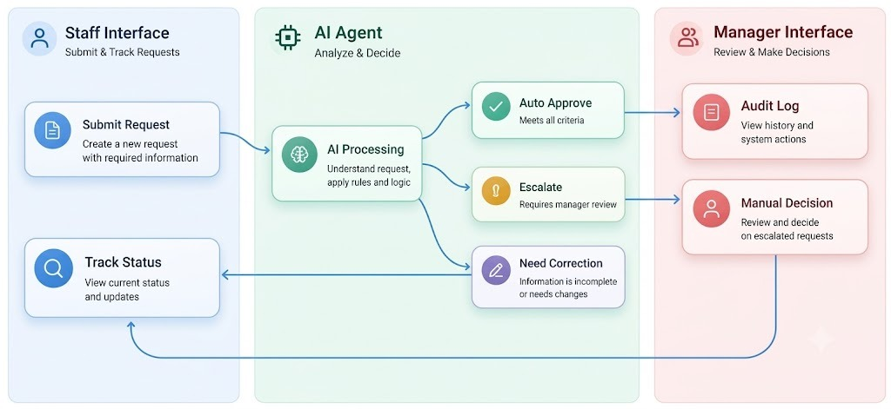
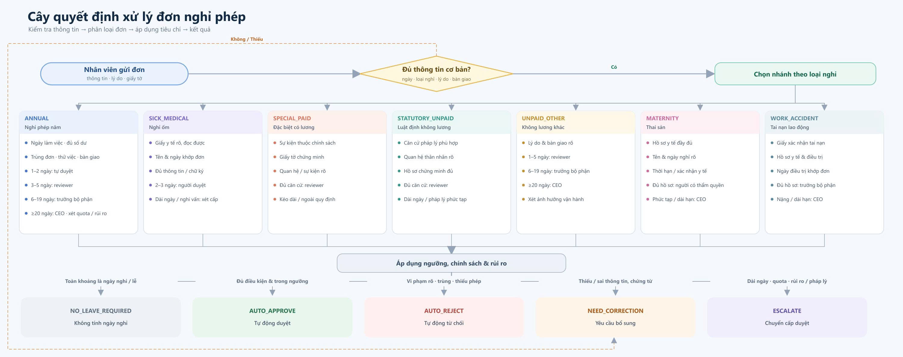

# The Escalation Referee — Hệ Thống Phê Duyệt Nghỉ Phép Doanh Nghiệp AI

[](https://python.org)
[](https://fastapi.tiangolo.com)
[](https://github.com/QwenLM/Qwen2.5-VL)
[](https://www.sqlite.org)
[](LICENSE)

> **Hệ thống điều phối xét duyệt nghỉ phép kết hợp Deterministic Rule Engine, Vision-Language Model (VLM) và Human-in-the-Loop Orchestration.**  
> *Triệt tiêu rủi ro ảo giác (Zero Hallucination) • Tự động hóa ca thường quy • Điều phối ngoại lệ chính xác*

**📺 Video Demo:** [https://youtu.be/FjoYJwa732c](https://youtu.be/FjoYJwa732c)  
**📊 Dataset Mẫu:** [Google Sheets Link](https://docs.google.com/spreadsheets/d/1_d9vUImx0TX7yeGoFwtnWIQRDaDFpi_XKqALEeNs1KA/edit?gid=1111531951#gid=1111531951)

[Tổng Quan](#tổng-quan-dự-án) • [Kiến Trúc Kỹ Thuật](#kiến-trúc-kỹ-thuật--quy-trình-backend) • [Giao Diện Hoạt Động](#giao-diện-hoạt-động-3-chế-độ) • [Ma Trận Phán Quyết](#ma-trận-phán-quyết) • [Phân Loại Ngoại Lệ](#phân-loại-ngoại-lệ-taxonomy) • [Cài Đặt & Khởi Chạy](#cài-đặt--khởi-chạy)

---

**Link kiểm thử hệ thống: https://pnkk-uit.lol/**

**Link dataset:** [dataset google sheets](https://docs.google.com/spreadsheets/d/1_d9vUImx0TX7yeGoFwtnWIQRDaDFpi_XKqALEeNs1KA/edit?usp=sharing)

**Link báo cáo tổng hợp:** [báo cáo tổng hợp](https://docs.google.com/document/d/1IUXfhizn1Xjo514ArIZ5kM0WyxalhPdWRSEZG86i3WI/edit?tab=t.0)


- **Thực trạng**: Phê duyệt nghỉ phép thủ công thường tốn nhiều thời gian đối chiếu giấy tờ và dễ bỏ sót sai phạm quy chế. Ngược lại, việc tự động hóa thuần túy bằng AI tạo sinh (Pure LLM) lại đối mặt với rủi ro nghiêm trọng về **ảo giác số liệu (hallucination)** — dễ tính sai ngày nghỉ cuối tuần/ngày lễ và duyệt sai thẩm quyền theo luật lao động.
- **Giải pháp**: **The Escalation Referee** ứng dụng mô hình kết hợp **Hybrid AI & Deterministic Validation**: sử dụng bộ máy quy chế tất định (Rule Engine) để triệt tiêu 100% ảo giác số liệu theo Bộ luật Lao động 2019, mô hình thị giác **Qwen 2.5-VL** để tự động thẩm định chứng từ y tế/kết hôn, và cơ chế **Human-in-the-Loop** chỉ tự động duyệt ca thường quy (≤ 2 ngày) đồng thời điều phối ngoại lệ đến đúng người có thẩm quyền kèm câu hỏi hành động trực diện.


## 2. Kiến trúc hệ thống



### 2.1. Tầng Backend

FastAPI, dựng app, đăng ký CORS, router, phục vụ frontend tĩnh, và làm nóng (warm-up) mô hình AI ngay lúc khởi động.


Bộ điều phối: nạp ngữ cảnh tin cậy từ DB → đọc facts (từ form hoặc gọi LLM nếu là văn bản tự do) → gọi VLM nếu có chứng từ → gọi rule engine → cập nhật trạng thái → lưu decision/giải trình/điều khoản chính sách → ghi audit.

### 2.2. Tầng Frontend

Trang tĩnh HTML/JavaScript thuần túy và không sử dụng framework.

| **File** | **Nội dung** |
|---|---|
| `index.html` | Bố cục: nav, form, hàng đợi người duyệt, trang chính sách, khu kiểm thử |
| `app.js` | Gọi API, nhãn vai trò/quyết định, khởi tạo tab, render danh sách đơn, submit form |
| `styles.css` | Giao diện, bảng, thẻ hiển thị |

Bốn chế độ dùng chung giao diện: cổng nhân viên, cổng người duyệt, trang chính sách, khu kiểm thử. Không gọi AI trực tiếp — mọi tương tác đều đi qua API backend.

### 2.3. Mô hình ngôn ngữ LLM

Sau khi Decision Tree kiểm tra đơn nghỉ, hệ thống đã có kết quả rõ ràng như tự động duyệt, từ chối, cần bổ sung thông tin hoặc chuyển cho người quản lý

Ở bước này, LLM không được quyết định lại kết quả mà chỉ làm nhiệm vụ tóm tắt kết quả và giải thích cho người dùng hoặc người quản lý dễ hiểu hơn.


**Persona & Prompt hệ thống**

Prompt hệ thống ràng buộc rất chặt, và nguyên văn logic:

> *"Prompt hệ thống: Vai trò của bạn là Trợ lý tổng hợp kết quả xử lý đơn nghỉ phép. Dựa hoàn toàn vào dữ liệu đầu vào (thông tin đơn, kết quả Decision Tree, và dữ liệu chứng từ), hãy tạo ra một bản tóm tắt ngắn gọn, dễ hiểu để trình bày cho nhân viên hoặc cấp quản lý.
"*


### 2.4. Mô hình thị giác (VLM) 

VLM nó chỉ đọc chứng từ hình ảnh và trích xuất facts khách quan có trên giấy, tuyệt đối không tự đưa ra phán xét về tính hợp lệ.

**Persona theo loại chứng từ**

Kỹ thuật phân vai của VLM là: gán một **persona chuyên biệt** phù hợp với loại chứng từ đang xử lý, áp fixed rule chống bịa dữ liệu, và bắt buộc output theo đúng schema JSON. Ba persona điển hình:

| **Loại chứng từ** | **Persona / Prompt hệ thống** |
|---|---|
| Hồ sơ y tế | "Bạn là chuyên gia kiểm tra hồ sơ y tế. Chỉ đọc thông tin trực tiếp có trên chứng từ, không suy diễn, không bịa dữ liệu. Nếu tên trên giấy không rõ, trả null. Nếu giấy mờ, đánh dấu `document_readability = UNREADABLE`. Không tự xác nhận chứng từ hợp lệ hay không hợp lệ. Chỉ trả về JSON theo schema đã định nghĩa." |
| Hồ sơ thai sản | "Bạn là chuyên gia kiểm tra hồ sơ thai sản. Chỉ xuất các trường hiện có trên giấy: tên bệnh nhân, nơi cấp, ngày cấp, chẩn đoán, khoảng thời gian chỉ định. Không suy luận về chính sách. Không tự quyết định phê duyệt. Trả JSON theo schema chuẩn." |
| Sự kiện gia đình | "Bạn là chuyên gia xác minh hồ sơ sự kiện gia đình. Chỉ trích xuất thông tin hình ảnh quan sát được: tên, quan hệ, thời gian, nơi tổ chức, chữ ký, dấu đỏ. Nếu thông tin thiếu hoặc mờ, trả null. Không thêm nhận định ngoài phạm vi giấy tờ." |

**Đầu vào:**

Đầu vào của VLM là file/ảnh chứng từ kèm metadata của đơn nghỉ liên quan:

```json
{
  "file": "/uploads/proof_123.jpg",
  "leave_type": "SICK_MEDICAL",
  "employee_name": "Nguyen Van A",
  "from_date": "2026-09-20",
  "to_date": "2026-09-21",
  "reason": "Đau bụng, cần nghỉ điều trị",
  "proof_type_hint": "MEDICAL_LEAVE_CERTIFICATE",
  "document_readability": "READABLE"
}
```

**Đầu ra**, gồm các fact đọc được trên giấy, cùng điểm đối chiếu với đơn xin nghỉ:

```json
{
  "patient_name_on_doc": "Nguyễn Văn A",
  "diagnosis": "Viêm ruột thừa",
  "issuer": "Bệnh viện Đa khoa X",
  "issue_date": "2026-09-19",
  "recommended_from_date": "2026-09-20",
  "recommended_to_date": "2026-09-21",
  "has_red_stamp": true,
  "has_doctor_signature": true,
  "document_readability": "READABLE",
  "is_tampered": false,
  "correlation_score": 0.92,
  "proof_type": "MEDICAL_LEAVE_CERTIFICATE",
  "correlation_issues": [],
  "raw_fields_detected": {
    "clinic_name": "Bệnh viện Đa khoa X",
    "doctor_name": "BS. Lê Hùng",
    "diagnosis_code": "K80",
    "prescribed_days": 2
  }
}
```

### 2.5. Cây quyết định (Decision Tree / Rule Engine)

Đây là nơi ra quyết định cuối cùng, nhận dữ liệu ghép từ ba nguồn: facts chứng từ từ VLM, và ngữ cảnh tin cậy từ cơ sở dữ liệu (số dư phép, lịch làm việc, các ngày nghỉ đã duyệt, người bàn giao, trạng thái nhân viên), cộng thêm định danh của người đang thao tác.

**Trình tự đánh giá gồm ba bước:**

1. **Kiểm tra đầu vào** — thiếu ngày, sai định dạng, thiếu loại nghỉ, thiếu lý do → cần sửa.
2. **Tuân thủ chính sách** — thiếu chứng từ → cần sửa/chuyển tiếp; vượt số dư → từ chối; chồng lấn ngày → từ chối; chứng từ mờ → chuyển tiếp; vi phạm báo trước → chuyển tiếp; vượt quota → chuyển tiếp/cảnh báo.
3. **Định tuyến theo thẩm quyền** — đủ điều kiện và nhỏ → tự động duyệt; lớn/phức tạp/vượt ngưỡng → chuyển tiếp đến Department Head hoặc CEO.





Ví dụ output khi cần chuyển tiếp:

```json
{
  "decision": "ESCALATE",
  "target_role": "DEPARTMENT_HEAD",
  "uncertainty_category": "AUTHORITY_ESCALATION",
  "error_code": "DURATION_OVER_AI_LIMIT",
  "human_readable_explanation": "Đơn nghỉ vượt mức tự duyệt cần xem xét bởi Department Head.",
  "actionable_question": "Bạn có đồng ý cho phép đơn này không?",
  "quick_action_options": ["APPROVE", "REJECT", "REQUEST_MORE_INFO"]
}
```


## 3. Giao diện

### Giao Diện 3 Chế Độ

Hệ thống cung cấp thanh chuyển đổi nhanh giữa 3 đối tượng người dùng:


**TEST**: Đánh giá & demo, khởi chạy Verify tự động 5 ca chuẩn; tra cứu kho dữ liệu 38 kịch bản


**MANAGER**: Escalation Inbox nhận ca ngoại lệ kèm Actionable Question, phê duyệt 1-chạm; xem nhật ký AI tự duyệt và tổng số hồ sơ submit


**STAFF**: Nộp đơn có tính ngày tự động, chọn nhân sự bàn giao, đính kèm chứng từ, theo dõi số dư phép tồn và lịch vắng mặt phòng ban


## 4. Cấu trúc dự án

```
MLAI/
├── backend/                      # Backend API Server (FastAPI + SQLite)
│   ├── main.py                   # Cấu hình FastAPI, static mount, CORS
│   ├── database.py               # Khởi tạo SQLite schema & ORM
│   ├── run_server.sh             # Script khởi động nhanh server
│   ├── routers/                  # API endpoints: leave, verify, meta
│   └── services/orchestration.py # Điều phối tương tác giữa Rule Engine, VLM & LLM
├── frontend/                     # Single Page Application (SPA)
│   ├── index.html                # Giao diện chính (Test, Staff, Manager)
│   ├── app.js                    # Xử lý logic nghiệp vụ, gọi API, quản lý Modal
│   ├── styles.css                # Thiết kế giao diện hiện đại, responsive
│   └── assets/proofs/            # Bộ chứng từ mẫu thực tế (y tế, kết hôn...)
├── Leave_Application/             # Bộ máy Quy chế Tất định (Deterministic Engine)
│   ├── policy_rules.md           # Bản quy chế nội bộ (Single Source of Truth)
│   ├── rule_engine.py            # Bộ quy tắc 7 bước thẩm định
│   └── vlm_inspector.py          # Module tích hợp Vision-Language Model
├── backend/ai/                      # Tác tử LLM (Agent Orchestrator)
│   ├── agent_orchestrator.py     # Suy luận ngữ cảnh tự nhiên, sinh câu hỏi tham vấn
│   └── prompts.py                # Prompts tối ưu hóa cho Qwen 2.5
└── tests/                         # Kịch bản kiểm thử tự động e2e & benchmark
```


## 5. Cài đặt và khởi chạy

Hệ thống được kiến trúc theo mô hình monolith hiện đại: Backend xử lý logic bằng **FastAPI**, đồng thời đảm nhận việc mount và phục vụ trực tiếp Frontend (Vanilla JS/HTML/CSS) để tối ưu hóa quá trình triển khai. Hệ thống **tự động phân giải đường dẫn module**, không yêu cầu gán thủ công biến môi trường `PYTHONPATH`.

### Cách 1: Khởi chạy trực tiếp bằng Python (Local)

**Bước 1: Sao chép mã nguồn**
```bash
git clone https://github.com/duonganhkiet2007/MLAI-PNKK-Leave-Management-System.git
cd MLAI
```

**Bước 2: Cài đặt thư viện phụ thuộc**
```bash
pip install -r requirements.txt
```

**Bước 3: Chuẩn bị mô hình Ollama (LLM & VLM)**
Hệ thống sử dụng Ollama cho tác tử ngôn ngữ và thị giác máy tính:
```bash
ollama pull qwen2.5:3b-instruct
ollama pull qwen2.5vl:7b
```
*(Hệ thống đã tích hợp sẵn cơ chế tự động resize ảnh chứng từ tối đa 1600px trước khi gửi VLM, giúp tối ưu tốc độ suy luận ~2-3s và tiết kiệm VRAM).*

**Bước 4: Khởi chạy Server**
```bash
cd backend
bash run_server.sh
# Hoặc khởi chạy trực tiếp uvicorn:
# python -m uvicorn main:app --host 0.0.0.0 --port 8000 --reload
```

---

### Cách 2: Khởi chạy bằng Docker & Docker Compose

Không cần cài đặt Python thủ công, chỉ cần có Docker:

- **Chạy backend (kết nối Ollama có sẵn trên máy host):**
```bash
docker compose up --build -d
```

- **Chạy toàn bộ cả backend lẫn Ollama trong container:**
```bash
docker compose --profile ollama up --build -d
```

- **Xem log hệ thống:**
```bash
docker compose logs -f backend
```

- **Dừng hệ thống:**
```bash
docker compose down
```

---

## Giao Diện Hoạt Động (3 Chế Độ)

Hệ thống được thiết kế theo kiến trúc Single Page Application (SPA), tích hợp bộ chuyển đổi chế độ làm việc cho từng nhóm người dùng:

| Chế Độ | Đối Tượng | Chức Năng Chính |
| :--- | :--- | :--- |
| **TEST** *(Mặc định)* | Quản trị & Nghiệm thu | Khởi chạy tiến trình **Verify** tự động trên bộ kịch bản chuẩn; tra cứu cơ sở dữ liệu 38 tình huống kiểm thử; xem popup chi tiết kèm Lightbox kiểm tra chứng từ gốc; đặt lại dữ liệu qua nút **Reset DB**. |
| **STAFF** | Nhân viên | Điền form đăng ký nghỉ phép có bộ tính ngày tự động; chọn nhân sự bàn giao trong phòng ban; đính kèm file chứng từ; theo dõi số dư phép còn lại và lịch vắng mặt nội bộ. |
| **MANAGER** | Cấp Quản lý | **Escalation Inbox** tiếp nhận các ca chuyển tiếp kèm câu hỏi tham vấn trực diện; thực hiện phê duyệt 1-chạm; theo dõi danh sách các đơn do AI tự duyệt và quyền thực thi nút **[ Hủy Lệnh AI ]**. |

### Chế độ TEST


### Chế độ MANAGER


### Chế độ STAFF


---

## Ma Trận Phán Quyết

Căn cứ theo **Bộ luật Lao động 2019** (Điều 112, 113, 115) và quy định Bảo hiểm Xã hội:


| Mã Phán Quyết | Tên Quyết Định | Điều Kiện Kích Hoạt | Hành Động Hệ Thống |
| :--- | :--- | :--- | :--- |
| **`AUTO_APPROVE`** | Tự động duyệt | Nghỉ phép năm ≤ 2 ngày, đủ số dư phép, nộp trước ≥ 24h, quota vắng mặt team ≤ 30%, bàn giao đầy đủ. | Hệ thống tự duyệt tức thì, trừ số dư phép năm, cập nhật lịch vắng mặt và ghi Audit Log. |
| **`AUTO_REJECT`** | Từ chối tự động | Số ngày xin nghỉ vượt quá số dư phép hiện có (`BALANCE_EXCEEDED`). | Tự động từ chối, không trừ phép, hướng dẫn nhân viên điều chỉnh hoặc làm đơn nghỉ không lương. |
| **`NEED_CORRECTION`**| Cần sửa đơn | Sai lệch số ngày giữa đơn và chỉ định y tế (`MEDICAL_DAYS_MISMATCH`), chứng từ mờ hoặc người bàn giao không hợp lệ. | Yêu cầu nhân viên điều chỉnh ngày nghỉ cho khớp với chứng từ y tế hoặc bổ sung hồ sơ. |
| **`ESCALATE`** | Chuyển Quản lý | Vượt thẩm quyền AI (nghỉ 3-5 ngày, nghỉ việc riêng có lương 3 ngày theo Điều 115 BLLĐ, nộp gấp, vượt quota 30%). | Gửi vào Escalation Inbox của Quản lý kèm câu hỏi tham vấn tự động và đề xuất xử lý nhanh. |

---

## Phân Loại Ngoại Lệ (Taxonomy)

Mọi trường hợp ngoại lệ đều được phân loại vào 3 nhóm bất định chuẩn hóa:

```
┌───────────────────────────────┐     ┌───────────────────────────────┐     ┌───────────────────────────────┐
│     1. UNCERTAIN_FACTS        │     │       2. OUT_OF_POLICY        │     │   3. AUTHORITY_ESCALATION     │
│   (Chưa rõ sự thật / Lỗi)     │     │   (Vi phạm quy chế công ty)   │     │   (Vượt thẩm quyền của AI)    │
│  • Cần xác minh lại chứng từ  │     │  • Nộp gấp, vượt quota team   │     │  • Đơn dài ngày (3-5 ngày)    │
│  • Xử lý: Nhân viên / HR Ops  │     │  • Xử lý: Quản lý trực tiếp   │     │  • Xử lý: Quản lý / Giám đốc  │
└───────────────────────────────┘     └───────────────────────────────┘     └───────────────────────────────┘
```

### Danh Mục 18 Mã Lỗi Quy Chuẩn

| STT | Mã Lỗi (`error_code`) | Phân Nhóm | Thẩm Quyền | Mô Tả Chi Tiết |
| :---: | :--- | :--- | :--- | :--- |
| **1** | `DATE_RANGE_INVALID` | `UNCERTAIN_FACTS` | `EMPLOYEE` | Ngày kết thúc trước ngày bắt đầu hoặc số ngày làm việc tính ra ≤ 0. |
| **2** | `DATE_MISSING` | `UNCERTAIN_FACTS` | `EMPLOYEE` | Đơn thiếu thông tin ngày bắt đầu hoặc kết thúc cụ thể. |
| **3** | `PROOF_MISSING` | `UNCERTAIN_FACTS` | `EMPLOYEE` | Nghỉ ốm ≥ 2 ngày nhưng không tải lên chứng từ xác minh. |
| **4** | `DOC_ILLEGIBLE` | `UNCERTAIN_FACTS` | `EMPLOYEE` | Ảnh chứng từ bị mờ, mất góc, không đọc được, thiếu mộc đỏ hoặc chữ ký. |
| **5** | `NAME_MISMATCH` | `UNCERTAIN_FACTS` | `HR_OPERATIONS` | Họ tên người bệnh trên giấy y tế không khớp với nhân viên làm đơn. |
| **6** | `MEDICAL_DAYS_MISMATCH` | `UNCERTAIN_FACTS` | `EMPLOYEE` / `MANAGER` | Số ngày xin nghỉ nhiều hơn ngày bác sĩ chỉ định. |
| **7** | `DOC_SUSPICIOUS` | `UNCERTAIN_FACTS` | `HR_OPERATIONS` | Chứng từ có dấu hiệu chỉnh sửa hình ảnh hoặc tẩy xóa bất thường. |
| **8** | `HANDOVER_INVALID` | `UNCERTAIN_FACTS` | `EMPLOYEE` | Người nhận bàn giao không hợp lệ (đã nghỉ, không cùng team, hoặc trùng lịch nghỉ). |
| **9** | `BALANCE_EXCEEDED` | `OUT_OF_POLICY` | `EMPLOYEE` | Số ngày xin nghỉ phép năm vượt quá số dư phép hiện có của nhân viên. |
| **10** | `NOTICE_PERIOD_VIOLATED` | `OUT_OF_POLICY` | `DIRECT_MANAGER` | Nộp đơn gấp vi phạm thời hạn báo trước (dưới 24h). |
| **11** | `TEAM_QUOTA_EXCEEDED` | `OUT_OF_POLICY` | `DIRECT_MANAGER` | Tỷ lệ nhân sự vắng mặt đồng thời của phòng ban vượt ngưỡng an toàn 30%. |
| **12** | `FLAG_ABUSE_PATTERN` | `OUT_OF_POLICY` | `DIRECT_MANAGER` | Chia nhỏ nhiều đơn nghỉ 1-2 ngày liên tục trong tháng nhằm lách hạn mức tự duyệt của AI. |
| **13** | `UNQUALIFIED_SPECIAL_LEAVE` | `OUT_OF_POLICY` | `EMPLOYEE` | Xin nghỉ việc riêng hưởng lương nhưng không thuộc diện Điều 115 BLLĐ. |
| **14** | `DURATION_OVER_AI_LIMIT` | `AUTHORITY_ESCALATION` | `DIRECT_MANAGER` | Đơn hợp lệ nhưng thời lượng từ 3 đến 5 ngày làm việc (vượt trần tự duyệt 2 ngày của AI). |
| **15** | `DURATION_OVER_MANAGER_LIMIT` | `AUTHORITY_ESCALATION` | `HR_DIRECTOR` | Đơn nghỉ phép năm dài hạn trên 5 ngày làm việc liên tiếp. |
| **16** | `LONG_TERM_UNPAID` | `AUTHORITY_ESCALATION` | `HR_DIRECTOR` / `CEO` | Nghỉ việc riêng không hưởng lương dài hạn trên 14 ngày làm việc. |
| **17** | `MANAGER_SELF_APPROVAL` | `AUTHORITY_ESCALATION` | `EXECUTIVE_BOARD` | Quản lý/Trưởng phòng tự nộp đơn xin nghỉ → Điều phối lên cấp trên trực tiếp. |
| **18** | `AUTOMATION_SCOPE_UNSUPPORTED`| `AUTHORITY_ESCALATION` | `HR_DIRECTOR` | Các chế độ phức tạp nằm ngoài phạm vi tự động hóa (nghỉ thai sản dài hạn, tai nạn lao động). |

---

## Cấu Trúc Thư Mục Dự Án

```
MLAI/
├── backend/                             # Máy chủ API (FastAPI + SQLite)
│   ├── main.py                          # Cấu hình ứng dụng FastAPI, static mount, CORS
│   ├── database.py                      # Khởi tạo SQLite schema và ORM models
│   ├── run_server.sh                    # Script khởi chạy server
│   ├── routers/                         # API endpoints: leave, verify, meta
│   └── services/orchestration.py        # Điều phối luồng giữa Rule Engine, VLM và LLM
├── frontend/                            # Giao diện người dùng Single Page Application
│   ├── index.html                       # Layout chính (Test, Staff, Manager)
│   ├── app.js                           # Logic xử lý giao diện, gọi API, quản lý Modal
│   ├── styles.css                       # Bảng định kiểu CSS responsive
│   └── assets/proofs/                   # Bộ chứng từ mẫu kiểm thử (y tế, kết hôn...)
├── Leave_Application/                   # Bộ máy Quy chế Tất định (Deterministic Engine)
│   ├── policy_rules.md                  # Bản quy chế nội bộ (Single Source of Truth)
│   ├── rule_engine.py                   # 7 bước kiểm tra điều kiện nghiệp vụ
│   └── vlm_inspector.py                 # Tích hợp Vision-Language Model quét chứng từ
├── backend/ai/                            # Tác tử LLM Agent (Orchestration & Reasoning)
│   ├── agent_orchestrator.py            # Phân tích ngữ cảnh tự nhiên, sinh câu hỏi tham vấn
│   └── prompts.py                       # Prompts tối ưu hóa cho Qwen 2.5
└── tests/                               # Bộ kịch bản kiểm thử tự động e2e & benchmark
```

---

## Cài Đặt & Khởi Chạy

### Yêu Cầu Môi Trường
- **Python:** Phiên bản 3.10 trở lên.
- **Hệ điều hành:** Linux (Ubuntu 20.04+ khuyên dùng), macOS hoặc Windows (WSL2).

### Khởi Chạy Server

Backend FastAPI đã được cấu hình phục vụ trực tiếp giao diện Frontend tĩnh trên cùng cổng:

**Cách A: Chạy trực tiếp (Local)**
```bash
cd backend
bash run_server.sh
```
*(Hoặc khởi chạy trực tiếp qua Uvicorn: `python -m uvicorn main:app --host 0.0.0.0 --port 8000 --reload`)*

**Cách B: Chạy qua Docker Compose**
```bash
docker compose up --build -d
```

Địa chỉ truy cập:
- **Giao diện Web:** [http://localhost:8000](http://localhost:8000)
- **Tài liệu API (Swagger UI):** [http://localhost:8000/docs](http://localhost:8000/docs)

> **Mẹo khởi chạy nền bằng TMUX (môi trường SSH):**
> ```bash
> tmux new -s mlai "cd backend && bash run_server.sh"
> # Nhấn tổ hợp phím [Ctrl + B], thả tay rồi nhấn [D] để thoát ra ngoài.
> # Khi cần xem lại log: tmux attach -t mlai
> ```

---

## Kiểm Thử Hệ Thống

1. **Kiểm thử trực quan trên Web UI:**
   - Mở [http://localhost:8000](http://localhost:8000) → nhấn nút **`Verify`**.
   - Thanh tiến trình sẽ lần lượt chạy qua các kịch bản kiểm thử chuẩn và cập nhật trực tiếp phán quyết của AI lên bảng dữ liệu.
   - Nhấn nút **`Chi tiết`** tại từng dòng để xem popup đối chiếu thông tin và ảnh chứng từ gốc qua Lightbox.
2. **Kiểm thử tự động qua CLI:**
   ```bash
   cd backend
   python test_api_e2e.py
   ```

---

Phát triển bởi Đội ngũ **PNKK** · **The Escalation Referee** © 2026
