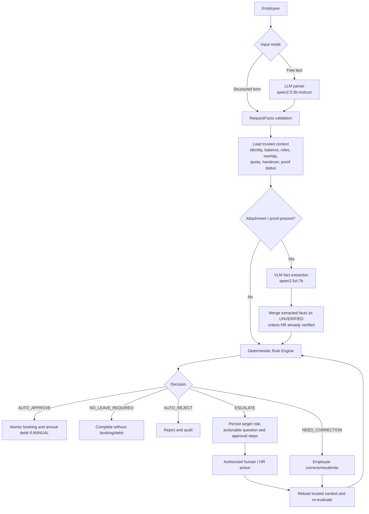
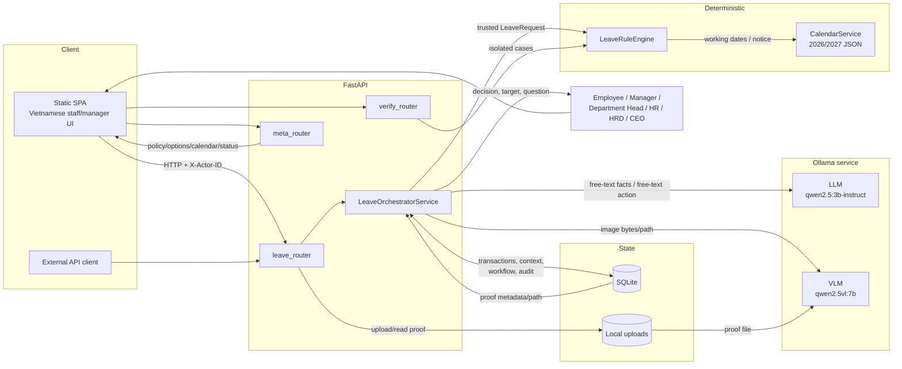
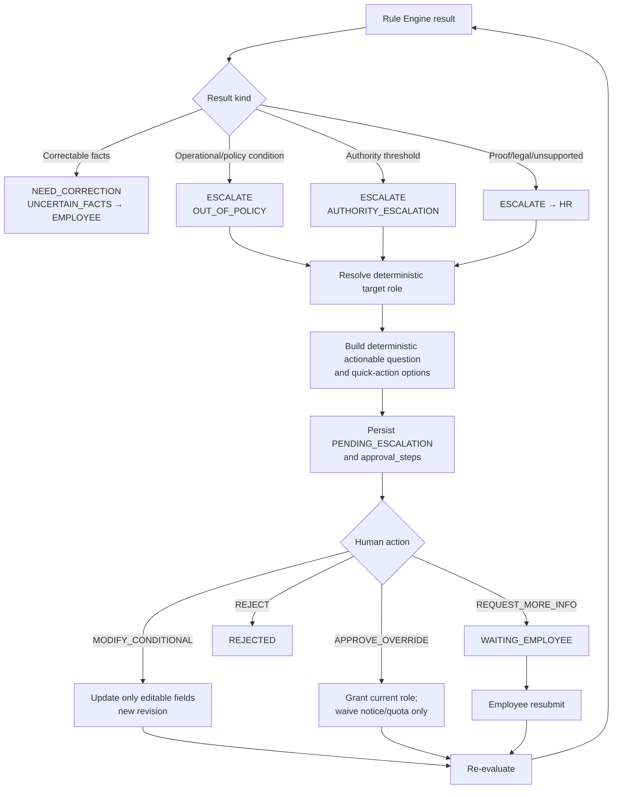
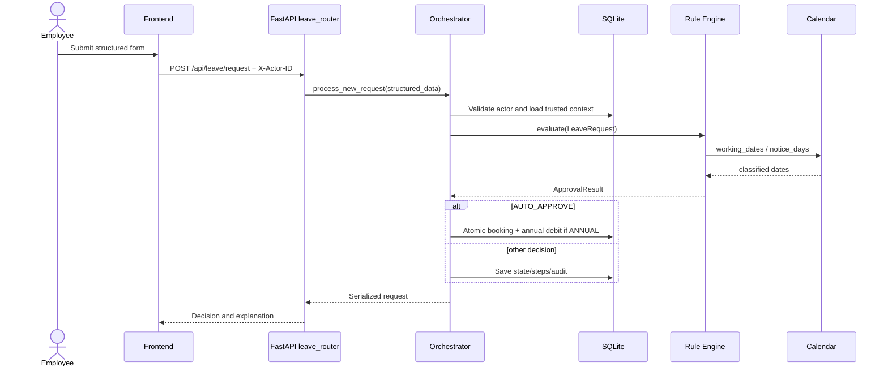
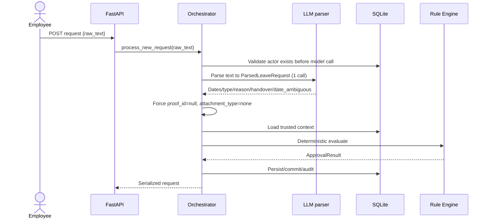

# Architecture and Workflow

Tài liệu này mô tả đường chạy hiện tại, không dùng kiến trúc in-process 7B trong các docs legacy. Hai model đều được gọi qua Ollama; FastAPI vẫn phục vụ API/SPA trên port 8000.

## A. Overall workflow



Structured data đi thẳng vào schema; chỉ free text mới cần LLM parser. Backend không nhận identity, balance, authority hay proof verification từ model. Nếu có file, VLM trích facts trước khi rule engine chạy, nhưng proof vẫn chưa được tin cậy cho đến khi HR xác minh. Rule engine tạo một trong năm decision. Correction quay lại employee; escalation tạo bước human; mọi modification/approval hợp lệ đều dẫn tới re-evaluation trước commit.

## B. Component Architecture



Frontend gọi ba router FastAPI. `leave_router` dùng orchestrator cho request lifecycle; `verify_router` gọi rule engine trực tiếp và không persist; `meta_router` cung cấp policy, calendar và AI status. Orchestrator là điểm ghép AI với trusted DB context. Rule engine chỉ nhận typed `LeaveRequest` và dùng CalendarService. SQLite lưu state/ledger/audit; file chứng từ nằm ở local uploads. Human tương tác qua UI/API, còn role luôn được lookup từ DB.

## C. Escalation flow



Question và routing được tạo từ result của engine, không cần LLM. `NEED_CORRECTION` về employee; `ESCALATE` đi tới role xác định. Button action được xử lý trực tiếp, còn free-text action chỉ dùng LLM để map vào whitelist. Conditional modification chỉ sửa ngày hoặc người bàn giao. Approval chỉ waive notice/quota, rồi engine tải lại balance, overlap, proof và context trước khi quyết định bước tiếp.

## D1. Sequence: Structured Form không proof



Đường này có 0 LLM và 0 VLM call theo code/tests. Actor được xác thực ở mức demo và context lấy từ DB. Rule engine tính calendar, kiểm policy và trả structured result. Chỉ `AUTO_APPROVE` mới gọi commit; chỉ `ANNUAL` bị debit. Persistence và balance mutation nằm trong transaction `BEGIN IMMEDIATE`.

## D2. Sequence: Form có proof bắt buộc (medical/special-paid)

```mermaid
sequenceDiagram
    actor E as Employee
    participant API as FastAPI
    participant FS as Upload storage
    participant DB as SQLite
    participant O as Orchestrator
    participant V as VLM
    participant R as Rule Engine
    actor HR as HR reviewer

    E->>API: POST /api/leave/proofs (PDF/JPEG/PNG)
    API->>FS: Store file
    API->>DB: Store UNVERIFIED proof record
    E->>API: POST medical/special-paid request with proof_id
    API->>O: Evaluate request
    O->>DB: Load proof + trusted context
    O->>FS: Resolve file path
    O->>V: Extract proof facts (1 call)
    V-->>O: ProofExtraction + diagnostic signals
    O->>R: Evaluate with status still UNVERIFIED
    R-->>O: ESCALATE / HR / PROOF_REVIEW_REQUIRED
    O->>DB: Persist result and VLM fields
    HR->>API: POST /proofs/{id}/verify
    API->>DB: Save HR verification facts/status
    API->>O: Re-evaluate linked request
    O->>V: Inspect proof again for this evaluation
    V-->>O: Diagnostic/extracted output; HR verification remains authoritative
    O->>R: Evaluate with VERIFIED proof
    R-->>O: Policy/authority result
    O->>DB: Persist/commit as applicable
```

Upload được kiểm size và magic MIME. VLM chạy một lần trong mỗi lần `_evaluate` có proof/attachment; vì vậy một lifecycle gồm initial evaluation và các re-evaluation có thể có nhiều VLM calls. Output không tự biến thành verified proof. Với loại medical/special-paid cần proof, rule engine chuyển HR nếu proof chưa verified. HR ghi facts và verification status qua endpoint riêng, sau đó linked request được tăng revision và đánh giá lại; trạng thái HR đã ghi vẫn là authoritative. Proof gắn vào loại nghỉ khác vẫn có thể kích hoạt VLM, nhưng không tự tạo yêu cầu HR nếu rule của loại đó không dùng proof. VLM không xác nhận authenticity với issuer bên ngoài.

## D3. Sequence: Free text request



Free text dùng đúng một LLM call cho extraction. Pydantic `extra='forbid'` ngăn model thêm identity, balance, authority, decision hoặc proof verification. Backend chủ động xóa proof fields sau parse, nên free-text path hiện không thể nộp proof trong cùng request. Nếu model không sẵn sàng, API trả `MODEL_UNAVAILABLE`; không có heuristic parser fallback.

## D4. Sequence: Human approval flow

```mermaid
sequenceDiagram
    actor H as Authorized human
    participant API as FastAPI
    participant O as Orchestrator
    participant L as LLM action parser
    participant DB as SQLite
    participant R as Rule Engine

    H->>API: POST /{request_id}/human-decision
    API->>O: action_type button or feedback_text
    O->>DB: Read request, require target role, capture revision token
    alt Button action supplied
        O->>O: Map action deterministically (0 LLM)
    else Free-text feedback
        O->>L: Extract whitelisted action (1 LLM call)
        L-->>O: HumanFeedbackResolution
    end
    O->>DB: Lock transaction, recheck revision and role
    alt REQUEST_MORE_INFO
        O->>DB: WAITING_EMPLOYEE
    else REJECT
        O->>DB: REJECTED
    else MODIFY_CONDITIONAL
        O->>DB: Update editable fields, increment revision
        O->>R: Re-evaluate
        R-->>O: New result/route
    else APPROVE_OVERRIDE
        O->>DB: Load granted steps; audit approval
        O->>R: Re-evaluate fresh context; waive notice/quota only
        R-->>O: Complete or route next role
        O->>DB: Mark current step and commit if final
    end
    O-->>API: Current serialized state
```

Workflow dùng optimistic revision token kết hợp transaction lock để phát hiện thay đổi đồng thời. Người nộp không thể tự duyệt; role và department scope lấy từ DB. HR proof/legal/unsupported cases không thể bị `APPROVE_OVERRIDE` bỏ qua. Multi-step unpaid tiếp tục qua các role còn lại. Final approval vẫn kiểm balance, overlap và proof trước khi tạo ledger/booking.
